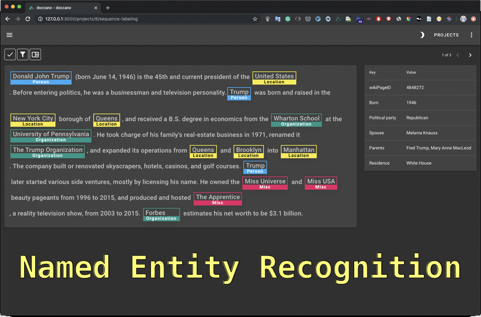

# NER algo benchmark: spaCy, Flair, m-BERT and camemBERT on anonymizing French commercial legal cases

Does (model) size matters?

<!-- more -->

<figure markdown>
  { width="100%", loading=lazy }
  <figcaption>Each of them is strong in its own way</figcaption>
</figure>

_This article is a continuation of a previous one about anonymizing of Courts of appeal
decisions: [Why we switched from Spacy to Flair to anonymize French case law](https://towardsdatascience.com/why-we-switched-from-spacy-to-flair-to-anonymize-french-legal-cases-e7588566825f)._

[According to several worldwide machine learning experts](https://www.kdnuggets.com/2019/12/predictions-ai-machine-learning-data-science-research.html)
like [Xavier](https://medium.com/u/dfc102dddf47?source=post_page-----d4ab01b2d4c3--------------------------------)
(Curai), [Anima Anandkumar](https://medium.com/u/865aadbce346?source=post_page-----d4ab01b2d4c3--------------------------------)
(Nvidia / Caltech)
or [Pedro Domingos](https://medium.com/u/60fd907d8004?source=post_page-----d4ab01b2d4c3--------------------------------)
(Washington University), one of the 2019 big trends was the usage of very large pre-trained language models (BERT,
Megatron-LM, AlBERT, RoBERT, …) to boost most NLP tasks scores.

I work at [Lefebvre Sarrut](https://www.lefebvre-sarrut.eu/), a publishing company which is a major player in the
European legal industry. As explained below, we are also helping several European administrations to anonymize their
legal decisions to push open data in justice.

We wanted to measure how better (if they are) these new large pre-trained models are compared to other options on a
Named Entity Recognition (NER) task applied to real life data, legal decisions.

Our previous article was about anonymizing courts of appeal decisions, this time we are interested into commercial
courts’ decisions. It’s a significant change as commercial decisions are more challenging to work with (higher writing
style diversity, paper scan noise, OCR errors, etc.).

In this article, ([^1]) we will openly explain our **context** and why a legal publisher spends time and energy to
concretely push open data in legal data, ([^2]) detail how we proceeded to **annotate** commercial decisions and ([^3])
finish by
a **benchmark** of the 4 main options for NER libraries to perform the anonymization task.

We tested 4 algorithms, 2 are Transformer based, 1 is bi-LSTM based, 1 has
an [original architecture](https://www.kdnuggets.com/2019/12/predictions-ai-machine-learning-data-science-research.html):

- [spaCy](https://medium.com/u/f6208eb7f56a?source=post_page-----d4ab01b2d4c3--------------------------------) v.2.2, this version introduces an interesting data augmentation mechanism similar to what we tried manually
  in [our previous article](https://towardsdatascience.com/why-we-switched-from-spacy-to-flair-to-anonymize-french-legal-cases-e7588566825f),
  does it work better?
- [Flair](https://github.com/zalandoresearch/flair): bi-LSTM character-based model, it brought the highest scores last
  time, is this going to repeat again?
- [multilingual BERT](https://github.com/google-research/bert) (mBERT): the famous Google model supporting 104
  languages, can you do good work with such large support?
- [camemBERT](https://camembert-model.fr/), a new mono-language BERT model for French, was it necessary to put energy to
  build such model when mBERT already supports French?

> _We publish NER scores on commercial decisions. They should be **carefully** compared to those of
the [previous article](https://towardsdatascience.com/why-we-switched-from-spacy-to-flair-to-anonymize-french-legal-cases-e7588566825f)
as the commercial court dataset is much harder to work on than the courts of appeal._
> 
> _If you are interested in this topic, follow me on Twitter: [https://twitter.com/pommedeterre33](https://twitter.com/pommedeterre33)_

## Why a legal publisher is so interested in anonymizing commercial legal cases for free through open sourcing its source code?

In France, [a law](https://www.economie.gouv.fr/republique-numerique) has been voted 3 years ago to put all legal
cases in open data so any citizen, litigant, lawyer, etc. can **freely** access them without having to pay anything to
anyone. Among all legal decisions, the situation of commercial legal decisions is specific.

Commercial legal cases are the decisions that mainly concern companies and business laws, ranging from simple commercial
litigation between companies to complex bankruptcy.

The intrinsic value of these commercial decisions is of high importance; as first instance judgments, they give a good
picture of the today country’s economic situation, contain factual details that are not found in courts of appeal cases
that are of interest for lawyers, large corporations, insurance, government (think for instance to bankruptcies, you get
details of what happened to thousands of companies day after day, etc.).

Moreover, you have derivative added value from the anonymization task (only natural persons are anonymized but many
entities are searched, including organization names), for instance with the company name information for each decision,
you can easily produce company files grouping all their decisions, which may be useful to monitor your clients,
providers, etc.

For historical reasons which made sense at the time, these decisions, which are by definition **public data**, are sold
by a consortium bringing together clerks of commercial courts[^1].

It may be surprising to read such thing in 2019, but appearances are deceiving, there are justifications for this state
of affairs. To make it short, a giant project called Portalis currently build by the French administration is supposed
to centralize legal decisions from all French courts. It is the kind of project that takes years to finish.
Entrepreneurs had the need to access commercial decisions, that’s why the clerk’s consortium have invested in
infrastructure to scan, centralize and distribute all legal decisions as scanned PDF, it’s a paid service to cover
costs.

  <h2>Where many see confusion, opportunists see business.</h2>

 

Some publishers tried to massively buy the commercial decisions (for distribution on their platform purpose), but none
reached a general agreement with the clerk’s consortium… until 2 years ago when the press revealed that a startup got a
**_de facto exclusive deal_** to get millions of them plus the flow for **free**[^2], making the resale of “exclusive”
public data the main focus of their product[^3].

Unfortunately for them, after months of communication around the size of their **paid database of locked public data**,
they made the headlines for having used illegal methods to get even more “exclusive” legal decisions[^4], losing the
deal as one of the consequences[^5]. Other attempts of exclusive access to legal decisions followed and failed[^6].

It is hard to say how ineffective the today’s situation is for everybody (citizens, litigants, lawyers, publishers,
startups, government). To make it short, today, **no one** has wide access to recent commercial decisions (newer than 1
year and a half), they only exist as PDF scan to be bought per unit or paper copy to manually ask for free, but that’s
not scalable at all.

In this context, the clerk’s association tries to improve things for everybody. It is very likely that these decisions
that are centralized and available as scanned PDF will be among the first ones to be added to the future open data
database of legal cases maintained by our Supreme Court[^7].

  <h2>The situation was so extreme that it made us question ourselves about things we didn’t focus on before and forced us to decide where we want to go.</h2>

 

The company I work for ([Lefebvre Sarrut](https://www.lefebvre-sarrut.eu/)) has made strong commitment toward opening
legal data across Europe (we have several #openJustice projects in different countries ongoing). We do our best to push
our own ecosystem in a state where access to legal decisions is **free for all**. With the article below, we want to
share that legal case anonymization of French commercial courts decisions is something doable with today’s technology.

All our work (but not the dataset for obvious data privacy reasons[^8]) is open
sourced ([repository](https://github.com/ELS-RD/anonymisation)) and can be easily
reproduced by anyone having access to the original commercial decisions.

Following is a description end to end to what we did and provide details about the results we reached.

## No, OCRization is not yet solved!

For this test, our work is based on scanned PDF of legal decisions provided by the commercial courts clerks association.

We had 2 options to OCR them: using a SAAS service like the [one](https://aws.amazon.com/fr/textract/) offered by Amazon
or using an open source solution to run on our own servers
like [Tesseract](https://github.com/tesseract-ocr/tesseract) (the major open-source library for this task) and do
everything by ourselves.

We choose [Tesseract](https://github.com/tesseract-ocr/tesseract), and to be honest, we are not sure we made the right
decision. It has been quite easy to reach decent results, but it cost us lots of time to improve over it.

Our main challenge is that we have not scanned the documents ourselves and the resolution was not optimal to get the
best results out of the box. For this reason, it required an important post process step, to clean noise or perform
simple things like identifying some tricky paragraph delimitation or non-uniform headers and footers.

We won’t provide more details on that part as it’s out of the scope of the article. Let’s just say that it was a **make
or buy decision** and we may have failed at it, we will come back to that later.

## The unsung heroes: annotation tools and quality control

It has been the most striking aspect of this project, each effort we put on the annotation quality has been translated
to score improvement, even the smallest ones.

Yes, data quality is important, we all know it, but how much?

### Our not anymore secret sauce, the data team

Annotation has been performed manually by a team of 5 jurists across July-August 2019 months (1 to 3 jurists at any
time). We set a goal of 500 or more cases annotated (following some observations on other annotation tasks we had). A
legal decision is a long document, and as shown below, **500 cases represent almost 60K entity mentions**.

Through this project and some other machine learning related one, the role of the data team is evolving to something
new: create data for algorithms and audit algorithm output (so far their role was more about providing support on
editorial products).

  <h2>It is indeed an interesting shift in the legal publishing industry that should perhaps be considered properly when
everyone around fancies about legal bots and digital labor…</h2>

 

The human part is one of the less documented and still most important parts of the project. **Annotation may be boring
AND is always demanding**. To better realize those points, all data scientists should participate in an annotation task.
Therefore they would realize why it is so important to take care of the user experience of the annotators. It means
choosing the tools carefully.

### Finding the right tool for the NER tagging task

The tooling directly impacts the productivity of the data team. Finding the right tool first requires to know what you
need, and then test them.

### Prody.gy from the authors of spaCy

We have used [prodi.gy](https://prodi.gy/)
from [Ines Montani](https://medium.com/u/c9f5e632b74f?source=post_page-----d4ab01b2d4c3--------------------------------)
and [Matthew Honnibal](https://medium.com/u/42936aed59d2?source=post_page-----d4ab01b2d4c3--------------------------------)
for some internal projects, it’s a nice tool, however, for this task it doesn’t fit our needs:

- not adapted UI to long documents (we need to display full documents to get enough context to tag)
- no easy way to have a view of all entities present in a document,
- no easy way to search specific entity mentions across documents,
- no advanced management and monitoring for multiple annotators,
- takes time to set up on our infra (requires internal meetings to get access to servers, etc.)

> _**Erratum**: to clarify what is said above, prodi.gy is able to load long documents and manage lots of entity
mentions in a single document, but its UI is better for short texts with a narrow context to help annotators to focus on
the task._

It is good to know that a tool addressing some of the points listed
above [is coming](https://support.prodi.gy/t/prodigy-annotation-manager-update-prodigy-scale-prodigy-teams/805).

<figure markdown>
  { width="100%", loading=lazy }
  <figcaption>prodi.gy and its unequaled UI</figcaption>
</figure>

### Doccano

Another choice we considered was [doccano](https://github.com/chakki-works/doccano) :

- better UI / UX for long document than [prodi.gy](https://prodi.gy/)
- Open source
- no advanced management and monitoring for multiple annotators working together
- takes time to set up on our infra (requires internal meetings to get access to servers, etc.)

<figure markdown>
  { width="100%", loading=lazy }
  <figcaption>doccano interface</figcaption>
</figure>

### [🍃tagtog](https://medium.com/u/72d1dec46312?source=post_page-----d4ab01b2d4c3--------------------------------)

We tested 3 paid SAAS tagging platforms, 2 of them had buggy API with a broken UX.

Finally, we used the third
one,[🍃tagtog](https://medium.com/u/72d1dec46312?source=post_page-----d4ab01b2d4c3--------------------------------). It
is not an open-source solution, the cost is 147 Euros per month. It matched all our needs without obvious drawbacks:

- Mature advanced multi-user mode
- Several tools to easily and rapidly review and improve annotation quality
- Works well with long documents
- Easy way to fix a specific pattern across multiple documents
- Zero setup, no server, no internal meetings

<figure markdown>
  { width="100%", loading=lazy }
  <figcaption><a href="https://medium.com/u/72d1dec46312?source=post_page-----d4ab01b2d4c3--------------------------------">🍃tagtog</a> tagging interface (there are few other screens)</figcaption>
</figure>

There was an annoying bug. It has since been fixed by
the [🍃tagtog](https://medium.com/u/72d1dec46312?source=post_page-----d4ab01b2d4c3--------------------------------) team,
which appeared quite reactive to our remarks.

  <h2>147 Euros per month is less costly than the cost of an engineer who set up and maintain a solution on our infra, and we
avoid the internal meetings to get access to servers for deployment.</h2>

If you have an annotation tool choice to do, my advice would be to always keep in mind that it is basically a **make or
buy decision**, with all the nuances in between. The set-up / maintain time of a server when you can avoid the step is a
kind of “make” choice (the deployment at least).

Therefore, to decide, you need to wonder how much you need to have a full control of your flow, what happens if it is
not exactly what you want, are your data sensitive (e.g. health), etc.?

Below is an interesting opposite opinion about in-house annotations:

<!--tweet is missing-->

### Annotation as an iterative task

The annotation challenge is to get the right data quality and quantity with as few resources as possible.

After having decided on the tool and the number of decisions we want to annotate, many questions remain:

- Is there an annotation methodology to follow?
- How to define the annotation plan?
- How to check and improve the quality?
- How to know if the quality is OK and when we can stop?
- How can we find improvement opportunities easily and rapidly?

The methodology we applied can be described as the following steps:

- Decide which kinds of entity we want (in our case similar to those of another project)
- Train a model on different data with similar entities
- Apply the model to 500 randomly chosen decisions to pre-annotate them
- Upload the decisions and their pre-annotations
  to [🍃tagtog](https://medium.com/u/72d1dec46312?source=post_page-----d4ab01b2d4c3--------------------------------)
- Fix manually annotations
  on [🍃tagtog](https://medium.com/u/72d1dec46312?source=post_page-----d4ab01b2d4c3--------------------------------)
- _[LOOP START HERE]_ Download annotations, train a model, measure
- Generate a report showing all errors (discrepancies between the tags and the prediction of the model)
- Manually identify patterns among errors (some are errors in annotations, some are errors in predictions)
- Manually fix annotations following the manually discovered patterns
  in [🍃tagtog](https://medium.com/u/72d1dec46312?source=post_page-----d4ab01b2d4c3--------------------------------)
- _[LOOP START HERE]_ Download data, learn a model, measure
- …

We insist on the importance of **manual analysis**. An automatic analysis would be similar to applying an _active
learning_ approach, which is known to have lots of limitations in many real life setups[^9].

  <h2>Only manual inspections of tags, which takes time, guarantee to avoid most bias and highest final results.</h2>

The hardest thing in our case was the need for more **homogenization** in annotations. We made 6 passes, trying to
homogenize the annotation of each entity type.

To illustrate the homogenization point, let’s take an example, we want to tag ORGANIZATION in decisions, meaning the
name of the ORGANIZATION, which are mostly companies in commercial decisions.

It is a usage in France to **cite** a company by putting its corporate form in front of its commercial name. Take for
instance _“SNC Café chez Lulu”_. _“SNC”_ is a corporate form (like [_“Limited
Partnership”_](https://en.wikipedia.org/wiki/Limited_partnership) in other countries). Therefore _in theory_ we should
not include _“SNC”_ in the tag, because we are not interested in that information.

It appears that a large part of French entrepreneurs **include** the corporate form in their commercial name during the
incorporation because they wrongly believe it is mandatory to do so. In those cases, if we check the French company
registry, the corporate form will appear **inside** the commercial name. Of course, another large part of entrepreneurs
don’t make the mistake.

At the end, when you read a decision and the corporate form sometimes appears in front of a name, you can’t really know
if it’s because it’s the complete real name or the way the judge cites this company (because that is the usage).

In theory you may check in the French company registry before tagging a company name, but it doesn’t matter, because if
your tags are not homogeneous and the context doesn’t tell you if the corporate form has to be included, your NER
algorithm will fail, no matter how smart it is.

Therefore, for homogenization reasons, we have decided to have a single rule, whatever the true name is, we always
include corporate form in ORGANIZATION tag. That’s the kind of _“details”_ that are discovered during the annotation
step.

The test set has been made in a second step, following all the annotation rules we have discovered during the first
annotation step.

### A large enough commercial decisions dataset

We have annotated 585 decisions (a bit more than planned because of our 2-step annotation process) from different
commercial courts in France. Writing styles are diverse, there are almost no shared conventions. It’s in part because in
France commercial judges are not professional judges but business people elected by their peers, they don’t share a
several years common training in law (like judges of courts of appeal for instance).

This is an important fact to keep in mind, compared to courts of appeal, it makes the task more complex for the NER
algorithm because machine learning models like repetitive patterns to identify.

Below we will test 2 BERT based algorithms. BERT has a limit regarding data it accepts: it’s limited to 512 wordpiece
tokens. It can be easily workarounds by splitting long sentences, however, to avoid corner cases, we just removed them
from the dataset. Of course, measures for all algorithms are performed on the same purged dataset.

We obtained 69.3K entities split among 10 types, organization names being the most represented, which makes sense for
commercial legal cases.

<figure markdown>
  { width="100%", loading=lazy }
  <figcaption>Entity mentions count</figcaption>
</figure>

We have described the nature of each type of entities in
our [previous article](https://towardsdatascience.com/why-we-switched-from-spacy-to-flair-to-anonymize-french-legal-cases-e7588566825f).
If not yet read, to summarize, PERS entity mentions are people names and the most important entity type to find (they
have to be anonymized), then come ADDRESS and ORGANIZATION.

As a comparison, French Treebank used in [CamemBERT](https://camembert-model.fr/) paper for the NER task contains 11636
entity mentions distributed among 7 different types.

## Deep learning based Named Entity Recognition in the spotlight

All trainings have been performed on the same hardware, a 12 core i7, 128 GB Ram and a 2080 TI Nvidia GPU.

Tests of Flair and BERT representations are done through the Flair library available at
this [repository](https://github.com/zalandoresearch/flair). The BERT
representation is not generated by Flair itself, under the hood, it calls the
awesome [Transformers](https://github.com/huggingface/transformers) library
from Hugging Face.

It again shows the importance of the open source ecosystem because all the tests below (but [spaCy](https://medium.com/u/f6208eb7f56a?source=post_page-----d4ab01b2d4c3--------------------------------)) 
have been performed by changing a single line of code, all libraries being able to talk together… wonderful!

We used Flair v0.4.4 from branch _GH-1221-fix-tokenization-problems_ 
(commit [3cea2fa](https://github.com/zalandoresearch/flair/commit/3cea2fa7588d043fb33bb33f50e67dff5cf86c84)) to benefit
from a fix on BERT tokenization.

### Data augmentation out of the box with [spaCy](https://medium.com/u/f6208eb7f56a?source=post_page-----d4ab01b2d4c3--------------------------------) 2.2

<figure markdown>
  { width="100%", loading=lazy }
</figure>

In this benchmark, we
use [spaCy](https://medium.com/u/f6208eb7f56a?source=post_page-----d4ab01b2d4c3--------------------------------) v2.2
from [Ines Montani](https://medium.com/u/c9f5e632b74f?source=post_page-----d4ab01b2d4c3--------------------------------)
and [Matthew Honnibal](https://medium.com/u/42936aed59d2?source=post_page-----d4ab01b2d4c3--------------------------------).
This version brings some improvements compared to previous ones, in particular a data augmentation schema.

Basically, [spaCy](https://medium.com/u/f6208eb7f56a?source=post_page-----d4ab01b2d4c3--------------------------------)
authors noticed that casing issues is a common challenge in NER and tend to confuse algorithms. It’s something very true
on legal decisions. To help the algorithm, they randomly generate variation in the casing. It is supposed to make the
model more robust to this issue.

According to our own experience described in
our [previous article](https://towardsdatascience.com/why-we-switched-from-spacy-to-flair-to-anonymize-french-legal-cases-e7588566825f),
data augmentation was a nice strategy to increase NER scores.

It is important to highlight that this model doesn’t suffer from any token quantity limit per sentence.

We trained
a [spaCy](https://medium.com/u/f6208eb7f56a?source=post_page-----d4ab01b2d4c3--------------------------------) model for
12 epoch during **less than one hour** (the most rapid algorithm we tested to early stop), and got the foll

<figure markdown>
  { width="100%", loading=lazy }
  <figcaption>spaCy NER scores</figcaption>
</figure>

Those scores don’t meet our requirements (69% recall on addresses is a bit low). It is not a surprise for us as we
already tried the data augmentation strategy on courts of appeal and we observed a real score improvement but not enough
to reach results from large pre-trained models.

### The almost classical character based bi-LSTM from Flair

<figure markdown>
  { width="100%", loading=lazy }
</figure>

[Flair](https://github.com/zalandoresearch/flair) representations[^10] are a bi-LSTM character based monolingual
model pretrained on Wikipedia.

It is important to highlight that this model doesn’t suffer from any token quantity limit per sentence. To be precise,
it has some character length limit, but it’s internally managed by the Flair library, and the user doesn’t have to know
about it.

We trained a model for 40 epochs for 8 hours, our scores are the following.

<figure markdown>
  { width="100%", loading=lazy }
  <figcaption>Flair NER scores</figcaption>
</figure>

> _Those results are lower than those obtained on courts of appeal. We think that the diversity of writing style plus
the OCR noise are the main reasons._

We know that we can easily boost scores by simply fine-tuning the model on the large commercial court decisions dataset
we have but the purpose of this benchmark is to know what we can get out of the box.

### multilingual BERT: 1 representation fits 104 languages

<figure markdown>
  { width="100%", loading=lazy }
</figure>

If you don’t know about BERT, you’d better read first these excellent dissecting BERT articles[^11].

Google released several versions of BERT, the main ones are:

- English only (cased and uncased) available in different sizes (meaning different flavors of slowness),
- Chinese only,
- Multilingual BERT (usually called mBERT): support of 104 languages[^12] in the same model.

  <h2>mBERT is an interesting option: the amazing power of BERT available for most existing languages… wait, it’s not that simple.</h2>

The trick to train a multilingual model is to first have a shared vocabulary between languages. At first it doesn’t make
sense, each language has its own vocabulary.

Following the literature about [BPE](https://en.wikipedia.org/wiki/Byte_pair_encoding) in NLP, they try to find subwords
that are shared instead of whole words. They use
[sentencepiece](https://github.com/google/sentencepiece) to analyze the multilingual dataset and find significant
subwords, meaning that a word can be split into several subwords. And with those subwords, you can try to learn a single
representation for each token, shared by several languages.

  <h2>Smart and beautiful idea, but does it really work?</h2>

 

It appeared that mBERT performances on English tasks were lower than the one of English BERT. Here and there, it also
appeared that the out of the box performances on small languages are not that high[^13]. And then came the MultiFit
paper[^14], showing that performances of mBERT can be significantly beaten by smart use of monolingual models[^15].

Still, the promise of mBERT is beautiful (one model fitting almost all languages) and because you need crazy resources
to train an end to end transformer based monolingual model, most practitioners are stuck to try to leverage mBERT.

That’s why we first did so: we tried to leverage mBERT on our commercial legal cases dataset. We fine-tuned the model
_bert-base-multilingual-cased_ for 78 epochs for less than a day.

The results are the following:

<figure markdown>
  { width="100%", loading=lazy }
  <figcaption>mBERT NER scores</figcaption>
</figure>

These results are low, in particular ADDRESS recall of 77% is quite low. Moreover, this model requires to respect a
512-token limit and is very slow to train and infer with a large memory footprint.

### camemBERT, when power comes with a funny name

<figure markdown>
  { width="100%", loading=lazy }
</figure>

Since the first release of BERT, things have slightly changed, few non-English BERT based models have been released, and
one of them is in French: [camemBERT](https://camembert-model.fr/)[^16] (after the name of a delightful cheese). The
architecture is largely inspired by an evolution of BERT
called [RoBERTa](https://ai.facebook.com/blog/roberta-an-optimized-method-for-pretraining-self-supervised-nlp-systems/).

It is interesting to note that the paper includes an experience in NER and reports a large improvement over mBERT
applied to French.

<figure markdown>
  { width="100%", loading=lazy }
  <figcaption>Texte</figcaption>
</figure>

In our case, data are dirtier than from the [French Treebank](http://ftb.linguist.univ-paris-diderot.fr/), as they come
from an imperfect OCR step.

The training lasted 9h30 (40 epochs). Our results are the following:

<figure markdown>
  { width="100%", loading=lazy }
  <figcaption>camemBERT NER scores</figcaption>
</figure>

It is much better than mBERT, and slightly better than Flair on some entities like ADDRESS. It is in line with
the [camemBERT](https://camembert-model.fr/) paper findings (slightly better than 2018 Bi-LSTM CRF SOTA).

Moreover, there are the BERT limitations:

- 512 token limit,
- memory footprint of Flair is much lower, making possible to have larger batch during inference (=
  speeeeeed).

## Conclusion

In this benchmark, we have compared 4 models on a real-life dataset, and our main observations are the following:

- With its original
  architecture, [spaCy](https://medium.com/u/f6208eb7f56a?source=post_page-----d4ab01b2d4c3--------------------------------)
  provides much lower performance than other tested models, the data augmentation schema is not enough,
- mBERT is a huge (slow) transformer model. On our NER task, it doesn’t translate into high scores, this observation is
  in line with findings from [camemBERT](https://camembert-model.fr/) paper,
- Flair and [camemBERT](https://camembert-model.fr/) provide similar results (slightly better
  for [camemBERT](https://camembert-model.fr/)) but [camemBERT](https://camembert-model.fr/) suffers from an annoying
  limitation regarding text size (the 512 token limit) and is slower than Flair on both training and inference.

Our conclusion is that in our case and for this dataset, Flair is still the best choice. Moreover, we think that with a
larger dataset for pre-training (or a fine tuning step on in domain data), the results may be even higher, as found by
our Supreme Court in its [NER paper](https://arxiv.org/pdf/1909.03453.pdf).

Indeed, it appears that [camemBERT](https://camembert-model.fr/) has been pre-trained on 138 Gb of uncompressed text
compared to Flair language model which only relies on French Wikipedia (more than 1 order of magnitude smaller).

  <h2>We want to highlight that the above scores are not the highest we can get, but the ones we have out of the box. It is
enough to decide on what algorithm to invest and improve.</h2>

 

Real production setups include for instance a post processing steps similar to the work of the Supreme Court cited above
which decreases by a large margin the error rate.

We don’t think that our findings would generalize to other tasks like classification. Character based language models
are very good at NER because suffixes and prefixes are powerful features, but in classification we would expect
[camemBERT](https://camembert-model.fr/) to easily beat Flair language model.

Moreover, in line with Multifit paper, it also shows that practitioners should think twice before working with mBERT. It
seems smart to use even simpler monolingual language model instead, when they exist.

As shown
previously, [spaCy](https://medium.com/u/f6208eb7f56a?source=post_page-----d4ab01b2d4c3--------------------------------)
model seems limited compared to today’s large models performance. Authors are working on it. It seems that all models
are moving in the same direction, and honestly I can’t wait for the result!

<!--image is missing-->

A discussion following
our [previous article](https://towardsdatascience.com/why-we-switched-from-spacy-to-flair-to-anonymize-french-legal-cases-e7588566825f)
comparing Flair and spaCy

To finish I want to thank **Sumi**, **Jonathan**, **Matthieu** (and its whole data team) and **Vincent** from Lefebvre
Sarrut for the contribution to the project and / or the review of this article :-)

## Notes

[^1]: Buying all of them would cost millions of Euros: 4.93 Euros per
decision ([https://www.infogreffe.fr/activite-judiciaire/rechercher-une-affaire.html](https://www.infogreffe.fr/activite-judiciaire/rechercher-une-affaire.html)),
when commercial courts have
released 137K decisions in
2018 ([http://www.justice.gouv.fr/art_pix/CC%202019_V8.pdf](http://www.justice.gouv.fr/art_pix/CC%202019_V8.pdf), p.11)

[^2]: **Tribunaux de commerce : l’exorbitant cadeau d’Infogreffe à Doctrine.fr
**, [https://www.lalettrea.fr/entreprises_tech-et-telecoms/2018/06/25/tribunaux-de-commerce--l-exorbitant-cadeau-d-infogreffe-a-doctrinefr,108314593-ge0](https://www.lalettrea.fr/entreprises_tech-et-telecoms/2018/06/25/tribunaux-de-commerce--l-exorbitant-cadeau-d-infogreffe-a-doctrinefr,108314593-ge0)

[^3]: **Doctrine veut centraliser toute l’information juridique disponible pour les professionnels du droit
**, [https://bfmbusiness.bfmtv.com/mediaplayer/video/doctrine-veut-centraliser-toute-l-information-juridique-disponible-pour-les-professionnels-du-droit-0907-1173997.html](https://bfmbusiness.bfmtv.com/mediaplayer/video/doctrine-veut-centraliser-toute-l-information-juridique-disponible-pour-les-professionnels-du-droit-0907-1173997.html)

[^4]: **Piratage massif de données au tribunal
**, [https://www.lemonde.fr/economie/article/2018/06/28/piratage-massif-de-donnees-au-tribunal_5322504_3234.html](https://www.lemonde.fr/economie/article/2018/06/28/piratage-massif-de-donnees-au-tribunal_5322504_3234.html)

[^5]: **Pourquoi Doctrine.fr est lâché par les greffes
**, [https://www.lalettrea.fr/entreprises_tech-et-telecoms/2018/09/27/pourquoi-doctrinefr-est-lache-par-les-greffes,108325460-evl](https://www.lalettrea.fr/entreprises_tech-et-telecoms/2018/09/27/pourquoi-doctrinefr-est-lache-par-les-greffes,108325460-evl)

[^6]: the future article R. 433–3 of Code of Judicial Organization explicitly includes commercial courts decisions in
the
future open database that one of our Supreme court will
maintain, [https://www.dalloz-actualite.fr/flash/open-data-des-decisions-de-justice-projet-de-decret#.XeTUzJNKhaQ](https://www.dalloz-actualite.fr/flash/open-data-des-decisions-de-justice-projet-de-decret#.XeTUzJNKhaQ)

[^7]: La distinction entre l’open data et l’accès aux décisions de
justice, https://www.dalloz-actualite.fr/flash/distinction-entre-l-open-data-et-l-acces-aux-decisions-de-justice

[^8]: The dataset is made of original legal decisions with all the personal information to be removed. It can’t be
shared as it would violate GDPR.

[^9]: **Practical Obstacles to Deploying Active Learning
**, [https://www.aclweb.org/anthology/D19-1003.pdf](https://www.aclweb.org/anthology/D19-1003.pdf)

[^10]: **Contextual String Embeddings for Sequence Labeling
**, [https://alanakbik.github.io/papers/coling2018.pdf](https://alanakbik.github.io/papers/coling2018.pdf)

[^11]: **Dissecting BERT**, [https://medium.com/dissecting-bert](https://medium.com/dissecting-bert)

[^12]: list of supported
languages, [https://github.com/google-research/bert/blob/master/multilingual.md](https://github.com/google-research/bert/blob/master/multilingual.md)

[^13]: **for instance this Reddit
thread
**, [https://www.reddit.com/r/LanguageTechnology/comments/bsfb8s/what_has_been_your_experience_using_multilingual/](https://www.reddit.com/r/LanguageTechnology/comments/bsfb8s/what_has_been_your_experience_using_multilingual/)

[^14]: MultiFiT: Efficient Multi-lingual Language Model
Fine-tuning, [https://arxiv.org/abs/1909.04761](https://arxiv.org/abs/1909.04761)

[^15]: To be precise a multilingual model ([Laser](https://github.com/facebookresearch/LASER) from Facebook) is used to
bootstrap things, but at the end the tasks
are performed by the monolingual models.

[^16]: **CamemBERT: a Tasty French Language Model
**, [https://arxiv.org/pdf/1911.03894.pdf](https://arxiv.org/pdf/1911.03894.pdf)