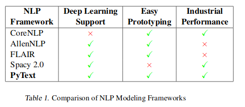
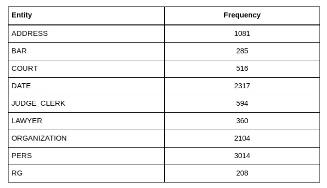
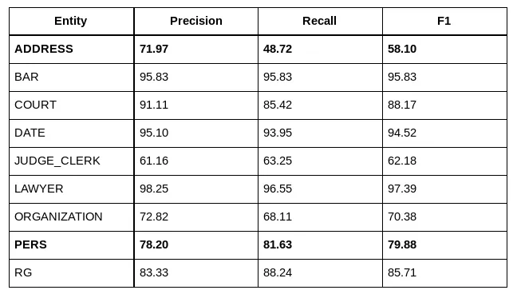
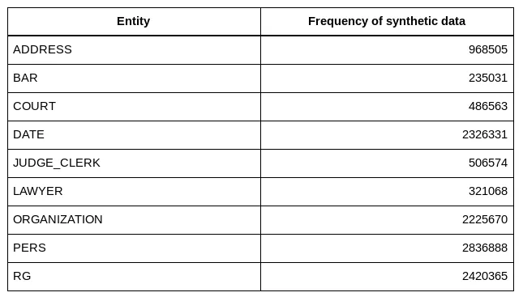
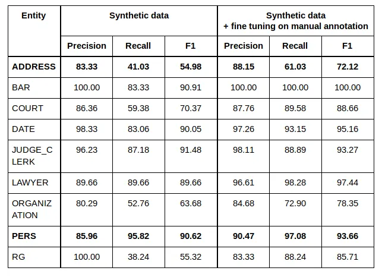
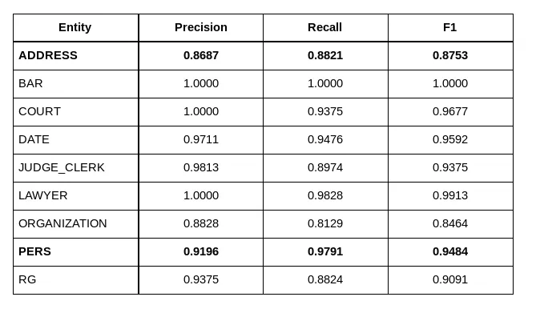

[//]: # (Our Spacy based code is [open sourced]&#40;https://github.com/ELS-RD/anonymisation&#41;)

# Why we switched from Spacy to Flair to anonymize French case law

… and why you should always review your options

<!-- more -->

<figure markdown>
  { width="100%", loading=lazy }
  <figcaption>#anonymization #ner #spacy #flair #legal #gdpr #opensource</figcaption>
</figure>

**This article details a work we
did [in collaboration](https://www.etalab.gouv.fr/la-mission-etalab-et-le-groupe-lefebvre-sarrut-collaborent-accelerer-louverture-des-decisions-de-justice)
with the French administration ([DINSIC](https://www.numerique.gouv.fr/dinsic/)) and a French supreme court
([Cour de cassation](https://www.courdecassation.fr/)) around 2 well-known Named Entity Recognition (NER below)
libraries, @spacy and Zalando [Flair](https://github.com/zalandoresearch/flair). Spacy
accuracy was too limited for our needs, and Flair was too slow. At the end we optimized Flair up to a point where
inference time has been divided by 10, making it fast enough to anonymize a large inventory of French case law. Major
ideas behind our approach are described below.**

I work at [Lefebvre Sarrut](https://www.lefebvre-sarrut.eu/), a publishing company which is a major player in the
European legal industry. Among other
things we publish legal cases in many countries, including France. It is mandatory for us to remove names of natural
persons appearing in a judgment because of privacy protection law (GDPR, and a French law related to case law). To
automate the process we trained a dedicated NER model on our annotated data.

Several options exist for this task, 2 open source libraries, each implementing different choices implying different
trade off, have been explored: [Spacy](https://spacy.io/), is very well engineered and documented, it mainly targets
machine learning
industrialization with its incomparable speed and decent accuracy in classical NER dataset,
and [Flair](https://github.com/zalandoresearch/flair) from [Zalando
Research](https://research.zalando.com/) is an open source library designed to reach the state of the art in NER,
modular enough to easily integrate all
kinds of NLP evolution but known to be slow.

> _If you are interested in this topic, follow me on
Twitter: [https://twitter.com/pommedeterre33](https://twitter.com/pommedeterre33)_

One year ago I had the opportunity to help to put in place an anonymization system based on [Spacy](https://spacy.io/).
I spent 1 month and a half to improve its accuracy.

A few months later, the French Supreme Court ([Cour de cassation](https://www.courdecassation.fr/)) with the help of
the [DINSIC](https://www.numerique.gouv.fr/dinsic/) (IT department of the
French administration) started to work on the same task. It appeared obvious to the Court, the French administration and
[Lefebvre Sarrut](https://www.lefebvre-sarrut.eu/) group that it would make sense to discuss our respective views on the
problem.

To [collaborate](https://www.etalab.gouv.fr/la-mission-etalab-et-le-groupe-lefebvre-sarrut-collaborent-accelerer-louverture-des-decisions-de-justice)
we started discussions about the challenges we were meeting, how we were solving them, and we used the
open source as a platform to share our work.

After considering several options, Supreme Court’s data scientists finally decided to base their work on Flair. On our
side, since the open source release, our requirements evolved, we got different sources of case law and more languages
to support. Because, as described below, our Spacy solution was not adapted, we also tried Flair. I worked 1 month on
it, mainly to reduce inference time.

On its side, and it is not in the scope of this article, the French supreme court worked on increasing the accuracy of
the Flair model, leveraging its modular design. They reached a 32% decrease of error rate with a better use of the
knowledge of the full dataset instead of just working at the sentence level! More info on [Valentin Barriere, Amaury
Fouret, “May I Check Again? — A simple but efficient way to generate and use contextual dictionaries for Named Entity
Recognition. Application to French Legal Texts”, 2019](https://arxiv.org/pdf/1909.03453.pdf).

<figure markdown>
  { width="100%", loading=lazy }
  <figcaption>Have you ever read a NLP paper from a national supreme court? <a href="https://arxiv.org/pdf/1909.03453.pdf">Here</a> is your chance :-)</figcaption>
</figure>

Our Spacy based code is [open sourced](https://github.com/ELS-RD/anonymisation) since last year (and has been updated to
last Spacy version since), following our
agreement with the French administration, and our work on Flair is already merged on master branch (to be included in
the next PyPi version).

This article tries to summarize those 2 works and our findings.

**TL;DR.** Out of the box Spacy accuracy in NER **on our data** was too low (not meeting our requirements), and with
time and specific work, we improved it significantly, but this project was specific to a case law inventory (i.e., to
appeal courts). Moreover our colleagues in Belgium, Spain, Nederland, etc. were not able to benefit easily from it. Out
of the box accuracy of Flair is better than Spacy **on our data** by a large margin even after our improvements on
Spacy (15 points difference on F1 on addresses for instance). However, the library was slower than Spacy. To apply it on
our inventory of French Court of appeal cases, it would have taken almost 30 days on a single recent GPU (Nvidia
2080TI).

    <h2>Without modifying the model (and its accuracy), nor adding the complexity or the cost of distributed computation, but “only” by improving the way computations are performed, inference time has been divided by 10 [1] (from 1mn 16s to 11s for 100 cases).</h2>

Instead of 30 days, a complete inventory processing takes less than 3 days. A 3 days processing is something we can
perform 1 or 2 times a year (when the model is significantly improved, for instance because of more annotated data). Our
Spacy model lives on an AWS lambda **[^2]**, making inference speed an irrelevant question.

We think that these results are interesting as Flair is sometimes described as a library not meeting “industrial
performance”, like for instance in the table below from the Facebook paper [Ahmed A. et al., “PyText: A Seamless Path
from NLP research to production”, 2018](https://arxiv.org/pdf/1812.08729.pdf). On the other side, Spacy benefits from a
very good image, and is supposed to be only slightly under SOTA with an unbeatable speed. Yet, **on our legal data**,
Spacy
scores were under our requirements.

<figure markdown>
  { width="100%", loading=lazy }
  <figcaption>Table extracted from the PyText paper comparing several NLP “framework”</figcaption>
</figure>

The implicit idea you sometimes see on machine learning blogs or Twitter discussions is that there are some trade-off
(no, not the bias / variance one): you need to choose between an accurate model (think big language models like Bert)
and speed. We think that this platitude may be challenged when required.

>
_There “[ain’t no such thing as a free lunch](https://en.wikipedia.org/wiki/There_ain%27t_no_such_thing_as_a_free_lunch)”,
but sometimes, if you work hard enough you can get a free dessert :-)_

The dataset we are using here is made of 100 judgments manually annotated, the frequency of each entity are:

<figure markdown>
  { width="100%", loading=lazy }
  <figcaption>Entity frequencies in our manually annotated dataset</figcaption>
</figure>

A few words about difficulties related each named entities:

- natural person name (**PERS**) is the most important named entity to detect. **LAWYER** and judge (**JUDGE_CLERK**)
  names are detected because we need to avoid to anonymize them, so it is to improve the NER precision on **PERS**.
- **ADDRESS** is the second most important entity to remove. It is quite tricky to detect them, because under this
  single category you find a variety of things, including street names, city names, building names, prison names, and
  many other localization names. Having some knowledge about the world (though pre-trained embeddings or pre-trained
  language model on Wikipedia) helps a lot on this category.
- **ORGANIZATION** is also tricky to find, it includes company names sometimes identical to a natural person’s name,
  sometimes it looks like localization, or just a common noun, etc. As judges use lots of capitalized words, a kind of
  context understanding is required. General knowledge from Wikipedia may not be enough.
- **BAR** name, **COURT** and **DATE** are easier to catch, a couple of regex would have a high recall.

To finish, those data are challenging, because they contain many typos (including space typo, where 2 words are merged
in one), names may look like nouns (missing the capitalized letter), in the same sentence you can have 2 times the same
text designing first a natural person and then an organization, etc.

  <h2>Those judgments are real life data, and are dirtier than most classical NER dataset.</h2>

This inventory of cases (Courts of appeal) is not the most challenging one to anonymize, but our work on Spacy only
applies to it. We limit to 100 judgments, as it represents the quantity of manually annotated cases we have for some
courts at Lefebvre Sarrut (we have between 100 and 600 cases per source).

In industrial applications where dataset are to be built, **annotation may represent a large part of the cost of a
project**. That’s why it is important to us that the model we are using doesn’t require hundreds of thousands of data
points to reach our requirements.

In the described work, default hyper parameters have been used for both algorithms as both libraries are supposed to
provide good results with them.

**Flair is modular by design**, meaning you can choose the representation you want to use. Zalando Research has shared
many
models, we used the combination described in the Zalando Research paper [Akbik A. et al, “Contextual String Embeddings
for Sequence Labeling”, 2018](https://alanakbik.github.io/papers/coling2018.pdf): a combination of FastText embeddings
(trained on French Wikipedia) and a character-based pre-trained language model (trained on French Wikipedia). No
fine-tuning of the language model on legal data has been performed.

For Spacy, there is no ready-to-download French pre-trained **generic** language model. A feature exists but is not yet
well documented regarding its Python API. On the website, there are some files called “language model”, but the
expression is used here to mean already trained for a specific task model (NER, classification, etc.). Unfortunately,
rapid tests we have performed showed us really poor results **on our legal data** with the French pre-trained NER model.

For the remaining of the article, split of data is made that way: train (80%), test (20%), no dedicated dev set (it is a
part of the train set) has been used as there has been no model hyper parameters tweaking at all (just early stopping
during training, it should not impact a lot our findings).

Measures are done by each library themselves.

We are using the last version of Spacy (V2.1.8 released in August 2019 by Spacy team) and master branch from Flair
(commit [899827b](https://github.com/zalandoresearch/flair/commits/899827ba9893a4b94677eb2348d4ffddd63adf47) dated as of
2019, Sept. 24).

> Below, we only publish results related to our inventory of courts of appeal case law, but we have observed the same
> differences (sometimes much stronger) between Flair and Spacy on each inventory of legal cases we have (some having 6
> times more manually annotated judgments).

First we describe our work to improve Spacy accuracy, then we explain how we made Flair 10 times faster.

## 1. Work on Spacy and Flair accuracy

Different experiences targeting the train dataset have been run to increase Spacy accuracy.

### 1.1 Spacy + manually annotated data

In this setup we only use the data manually annotated (100 French judgments). Nothing fancy, data is converted to the
expected format by each library, and, as explained above, training is performed using default parameters.

<figure markdown>
  { width="100%", loading=lazy }
  <figcaption>Spacy on the manually annotated dataset</figcaption>
</figure>

**Results from Spacy out of the box are low: the model doesn’t match our expectations on the most important entities**
(recall of 90% of natural person names and over 80% of the addresses).

> _It’s interesting to note that [BlackStone project](https://research.iclr.co.uk/blackstone) has reported some “weak”
scores on NER with Spacy applied to UK case law. They are working on increasing the size of their dataset, it would be
interesting to see if Spacy behavior is similar to the one we got._

Most errors are capitalized words seen as entities when they are just proper or even common nouns, any combination of
digits looks like a judgment identifier to the algorithm, etc. **For us it looks like Spacy has under-fit the data,
maybe because the dataset is too small compared to the complexity of the task**.

However, it is not obvious how far such algorithm can go with more data. It is important to note that Spacy has a very
original internal design (time performance oriented), closer to a dependency parser than classical CRF. As far as I
know, there is no literature on the performance of such design with different kinds of data.

  <h2>Inference takes 25 seconds on 1 CPU core!</h2>

It’s a good timing compared to the other solution we have tried before for this task. In the other experiences below,
Spacy inference time is stable. Spacy memory foot print makes possible to load the model in an AWS Lambda.

### 1.2 Spacy + manually annotated data + synthetic data

To improve the accuracy, we tried to generate a large quantity of synthetic data, train on them and finally fine-tune on
the manually annotated data.

The idea is the following: rule-based approach to catch entities are easy to write for simple patterns. To catch more
complex patterns, you tend to add more rules, and then the whole thing starts to be both slow and difficult to maintain.

For instance, catching a name in a sentence is easy with a regex like “_Mr [A-Z][a-z]+_”. Then you need to catch names
not preceded by Mr, and names without upper case, etc. until your regex is too complex to be modified.

  <h2>However, the difficulty to generate complex synthetic data is much lower than catching real named entities.</h2>

Take an existing sentence with a simple pattern, for instance “Hi Mr. Martin, how are you?”, compute the offset of the
full entity (Mr. Martin), then search for “Mr.” inside the entity and remove it. The sentence is now “Hi Martin, how are
you?”. Want harder to learn data points: remove the upper case (Hi martin, …), etc. And now, you have new data points
with different levels of complexity to feed your machine learning model with.

This is the main idea behind our approach, the only difference is that we added plenty of complex data generator for
several kinds of entities (if you are interested, you can check the README of
our [repo](https://github.com/ELS-RD/anonymisation)). It is not an original idea,
recently [Xavier Amatriain](https://medium.com/u/dfc102dddf47), famous guy in the recommender system
industry, [wrote](https://medium.com/@xamat/data-as-prior-innate-knowledge-for-deep-learning-models-23898363a71a) about
the same approach.

The purpose of this approach for us is to try to get the best of both worlds: high accuracy with low inference time.

We have generated millions of entities on a sub-sample of our complete inventory. Then we trained a model on them, and
fine-tuned it on the manually annotated data.

<figure markdown>
  { width="100%", loading=lazy }
  <figcaption>Frequencies of the generated named entities</figcaption>
</figure>

Our results are the following:

<figure markdown>
  { width="100%", loading=lazy }
  <figcaption>Comparison of results of learning based on synthetic data, without and with manually annotated data</figcaption>
</figure>

We note large boost in quality of the most important entity to anonymize (PERSON): +15 points of recall. Address is
still too far from our requirements.

We can still add rules, but the drawback of such approach is that it is not general enough. If we want to switch
language, or work on another court, we need to write new rules or adapt existing ones.

  <h2>We have exchanged manual annotation cost with programming and maintaining source code cost.</h2>

Basically, the approach generates a high technological debt, but provides a significant boost in quality.

We have also tried to distill Flair predictions in Spacy (generate a very large dataset with Flair and pretrain Spacy on
it), it constantly provided a performance boost with lower results in quality than the synthetic data approach. One of
the possible causes is that synthetic data patterns are easier to catch for Spacy.

### 1.3 Flair + Pre trained LM + manually annotated data

Flair offers a modular framework. You can for instance decide how you want to represent each token, choosing between
FastText embeddings (WikiPedia trained), a pre-trained character LSTM based Language model (Wikipedia trained), all the
new transformer stuff (Bert, XLnet, etc.) offered by the
trendy [Transformer library](https://github.com/huggingface/pytorch-transformers) from the prolific HuggingFace team, or
even a simple not pre-trained character based representation like
in [Lample G., “Neural Architectures for Named Entity Recognition”, 2016](https://arxiv.org/abs/1603.01360), etc.

Following the SOTA approach described Zalando paper, we have used both FastText embeddings trained on French Wikipedia
and Flair Language model trained on French Wikipedia.

As said before, we kept default hyper parameters and no language fine-tuning has been performed. According to the
supreme court paper, such fine-tuning should bring us a +1 point of accuracy.

Results are the following:

<figure markdown>
  { width="100%", loading=lazy }
  <figcaption>Flair scores on the manually annotated dataset</figcaption>
</figure>

Scores are very high compared to Spacy, and over our requirements, maybe even over our expectations.

Inference takes **1mn 16s** on our Nvidia 2080 TI GPU using released version Flair 0.4.3. However, to be fair with
Spacy, we
should keep in mind that there is also the training of the language model (ready to download) done by Zalando Research
team on their V100 to include, in some way, plus the time spent to train FastText.

The timing has been measured several times and is stable, at the second level.

As explained before, our legal case inventory is large, and this timing is not acceptable, that’s why we spent some time
working on inference time.

## 2. Making Flair 10 times faster!

As already said, Flair was slow compared to Spacy.

Below we explain the main strategies applied to get inference time reduction. We provide links to the original PR if you
want to check the code, get a longer description or even have the improvement in timing.

The measures have been performed with cProfile **[^3]**. One important thing to keep in mind is that PyTorch is mainly
asynchronous. Because of that, if nothing is done to take care of asynchronous computation, some operations will appear
extremely slow because they need to be synchronized (most CPU ⇔ GPU transfers, some tensor copy, etc.). To avoid working
on a fake slow operation, you need to set _CUDA_LAUNCH_BLOCKING=1_ first.

### 2.1. The old and slow Prof. A. Viterbi

> _[https://github.com/zalandoresearch/flair/pull/1038](https://github.com/zalandoresearch/flair/pull/1038)_
>
> _[https://github.com/zalandoresearch/flair/pull/1053](https://github.com/zalandoresearch/flair/pull/1053)_

Using cProfile, we noticed that the Viterbi algorithm was taking most of the time. Viterbi algorithm is a key part of
CRF algorithm, and even in deep learning based NER, CRF may bring large improvements (in our case, disabling CRF
decreases micro F1 by 6 points, a similar in effect decrease to what is described in Lample paper on the German CONLL
dataset for instance).

The source code of Flair Viterbi implementation was an official PyTorch
website [page](https://pytorch.org/tutorials/beginner/nlp/advanced_tutorial.html). Description of the Viterbi
algorithm can be found easily, but to summarize, its purpose is to find the most likely combination of tags for a
sequence, when there are dependencies between tags. The way it works requires intermediate states making the exercise
more complex.

The implementation is quite easy to read, understand and debug but was not very optimized.

To reduce inference time 2 things have been performed:

- By moving the computation of the Viterbi part from the GPU to the CPU, inference time has been reduced by 20%.
  Basically, we almost just called to(_“cpu”_) method. It may be surprising, but if you look at the code, you rapidly
  understand that a GPU is not very useful, plus some operations were doing many small memory transfers from GPU to CPU
  instead of a single big one;
- Rewriting the Viterbi part in Numpy and vectorizing as many operations as possible pushed the optimization up to 40%
  inference time decrease.

Vectorization is basically the process of replacing a for loop by a vector operation. The time reduction is because 2
things, first you limit the need to exchange information between internal C of Numpy and Python side, the second is
because Numpy works on continuous blocks of memory, and can make some computation optimization, including for instance
[SIMD operations](https://github.com/numpy/numpy/blob/master/numpy/core/src/umath/simd.inc.src) (parallelization on 1
CPU core).

Another interesting optimization was to leverage broadcasting. During a computation, we need to add a vector to each
column of a matrix. Before optimization, this vector was duplicated enough times to obtain the same shape as the matrix
to add with. Broadcasting is a way to avoid the creation of the new matrix (with its memory copy) by letting Numpy
simulate its existence through a for loop in the C part. Simple and useful tricks to keep in mind.

To sum up, with a rewriting of a single function, timings have been almost been cut in half.

### 2.2 Attack of the clone()

<figure markdown>
  { width="100%", loading=lazy }
</figure>

> _[https://github.com/zalandoresearch/flair/pull/1074](https://github.com/zalandoresearch/flair/pull/1074)_
>
> _[https://github.com/zalandoresearch/flair/pull/1089](https://github.com/zalandoresearch/flair/pull/1089)_
>
> _[https://github.com/zalandoresearch/flair/pull/1095](https://github.com/zalandoresearch/flair/pull/1095)_

When you subset a tensor, the new tensor gets a pointer towards the original storage layer tensor (a “simple” array in
memory containing the data). That’s why the operation takes almost no time, the new object being just made of offset and
stride information.

Calling clone() makes a real copy of the storage layer, making the operation much slower.

During training and inference, a representation is computed for each character of each sentence of the batch. The only
characters we are interested in are those at the beginning and end of each token (Flair language model is
bidirectional).

During training, there are several epochs, and computing each token representation takes time, so we want to keep them
in memory. To avoid out of memory exception, we need to clone the character representations we want to keep, and drop
the original large matrix where all unnecessary characters are still stored.

During inference, things are different, we can keep the full matrix in memory during computation and at the end of the
batch drop all representations. That way we avoided calling clone() and its slow memory copy and gained a significant
speed boost.

### 2.3 Never forget!

> _[https://github.com/zalandoresearch/flair/pull/1084](https://github.com/zalandoresearch/flair/pull/1084)_

Flair language model is context-based, meaning token representation depends on its context, so there is no easy way to
recycle them between different sentences sharing some tokens. This is not the case of FastText embeddings which are
static.

For limited GPU memory reasons (on Flair you can use plenty of token representations at the same time), they are not
preloaded on GPU memory, so for each token we extract its representation from CPU Ram and move it to GPU RAM. As you
have probably guessed, memory transfer takes time, and we don’t like them.

Because of [Zipf Law](https://en.wikipedia.org/wiki/Zipf%27s_law), few tokens represent most of the transfers, so we
just setup a simple LRU cache where we store
10000 FastText tensors already moved to GPU memory. Simple and efficient: we got almost the performance of a full GPU
load for a fraction of its memory footprint.

### 2.4 Being lazy to be fast

<figure markdown>
  { width="100%", loading=lazy }
</figure>

> _[https://github.com/zalandoresearch/flair/pull/1093](https://github.com/zalandoresearch/flair/pull/1093)_
>
> _[https://github.com/zalandoresearch/flair/pull/1130](https://github.com/zalandoresearch/flair/pull/1130)_

To represent a token we are using both FastText and Flair language model (you are free to add more). Flair Language
model is very powerful but when the context is new, it doesn’t work very well. In those cases, FastText embeddings bring
more useful information.

To merge the knowledge of both representation, we just concatenate them at the token level.

Later we concatenate each token representation at the sentence level, and each sentence representation are concatenated
together to get the batch representation.

The main idea here… is to avoid memory copy, by being as lazy as possible and only perform a single concatenation at the
very end of the process.

### 2.5 Miscellaneous

Several other PR have focused on call reduction of some operations (detach, device check, etc.), or just fix bugs. They
are not listed because very specific to the project source code and quite boring.

> _[https://github.com/zalandoresearch/flair/pull/1022](https://github.com/zalandoresearch/flair/pull/1022)_
>
> _[https://github.com/zalandoresearch/flair/pull/1142](https://github.com/zalandoresearch/flair/pull/1142)_
>
> _[https://github.com/zalandoresearch/flair/pull/1031](https://github.com/zalandoresearch/flair/pull/1031)_

Some work has also been performed to improve the API, for instance to make it easy to use third-party tokenizer (like
the blazing fast Spacy one), or easier use of the NER visualization module (largely inspired by Spacy).

> _[https://github.com/zalandoresearch/flair/pull/1068](https://github.com/zalandoresearch/flair/pull/1068)_

Vectorization optimization has also been applied to inference when CRF is not used for a large performance gain. It had
no effect on our project as we are using CRF.

### 2.6 Future optimizations?

There are still remaining opportunities, for instance on the Viterbi algorithm. The question is how to reach them.

For instance, [Ray](https://github.com/ray-project/ray) seems to be an interesting option, and with careful batching we
can divide the time spent on Viterbi by 4 (a 1.5 second gain on the remaining 11 seconds). For that, Ray performs a very
smart multiprocessing and leverages Reddis and Apache Arrow to distribute computations on CPU cores. If for some reason
Flair crashes, Redis server stay in memory which is not super cool.

Another approach is through Cythonization, but right now, I haven’t reached the performance of Ray, plus it would mean
introducing a new language, making maintenance harder, releasing wheels, etc. Is it worth it? Not sure.

At some point, when most low-hanging fruits have been gathered, optimizations start to be more costly, and maybe it is
time to focus on something else.

Also, there are the optimizations we have not considered so far, those impacting the nature of the model. As written
many times, Flair is modular, you can use several kinds of language model and some are less computation costly. More
over mixed precision has not yet been tested (there is a little bug to fix first) but improvement on NER seem to be
limited from our rapid experiences.

## Conclusion

The purpose of this article is not to demonstrate in any way that some library is superior to some other one. It is not
even the case, Spacy is still faster, but the optimizations described above make Flair a better solution for our use
case.

Another thing that deserves to be highlighted is the modular design of Flair. In my opinion, it is largely underrated,
it helps to rapidly integrate many evolution happening in the NLP field.

Maybe a more thoughtful takeaway is how engineering is important in machine learning. Though it seems to be not that
important to the field and most of its community. For instance, at SIGIR 2019 (the main information retrieval
conference) this year, on all the conference I attended, I have heard about performance and speed only during the
commercial search engine workshop.

These last months, several distillation based approaches have been released by different teams to try to use indirectly
large models like Bert. This kind of work tends to not “add up” and be forgotten after a few months.

Maybe some work on the engineering part would far more benefit to the community. For instance, projects
like [TVM](https://tvm.ai/) (a multi-framework machine learning model compiler),
or [Glow](https://github.com/pytorch/glow/blob/master/README.md) (a PyTorch dedicated compiler) may bring large
performance gains to current and future models, even if right now it still requires good knowledge of framework
internals. They really deserve to be better known and more support from the community.

**To finish, I want to thank a lot the Zalando Research team behind Flair, and in
particular [@alanakbik](https://github.com/alanakbik), for their advice, and its rapidity to review the many PR (and
provide adequate advice to improve them).**

## Notes

[^1]: On the well-known public dataset CONLL 2003, inference time has been divided by 4.5 on the same GPU (from 1mn44s
to
23s), the difference in the effect of the optimizations is mainly due to the presence of many very long sentences in the
French case law dataset, making some optimization more crucial. According to measures from the Zalando Research team,
same improvement on this dataset has been observed on the powerful Nvidia V100. Each timing difference is reported
inside the description or the comments of each PR.

[^2]: By the way, if you are thinking of putting Spacy in an AWS lambda, think twice, lambda cold start is slow and
requires careful management…

[^3]: I have found the profiler viz of Pycharm very useful.