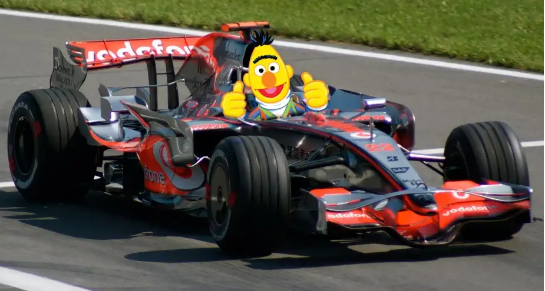
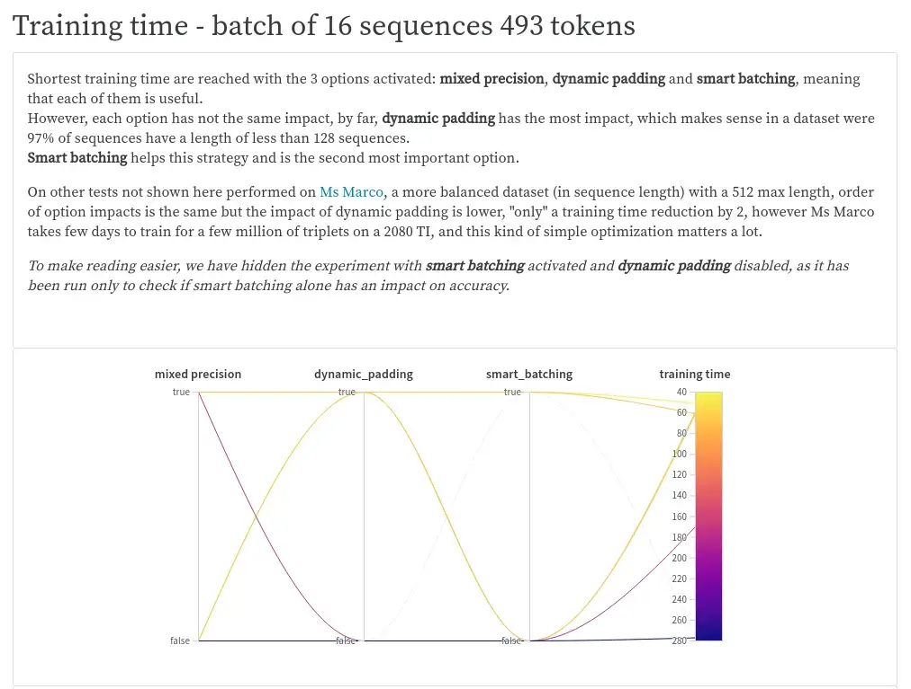
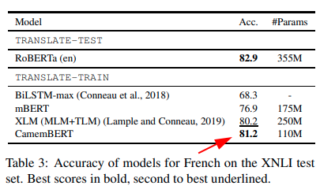
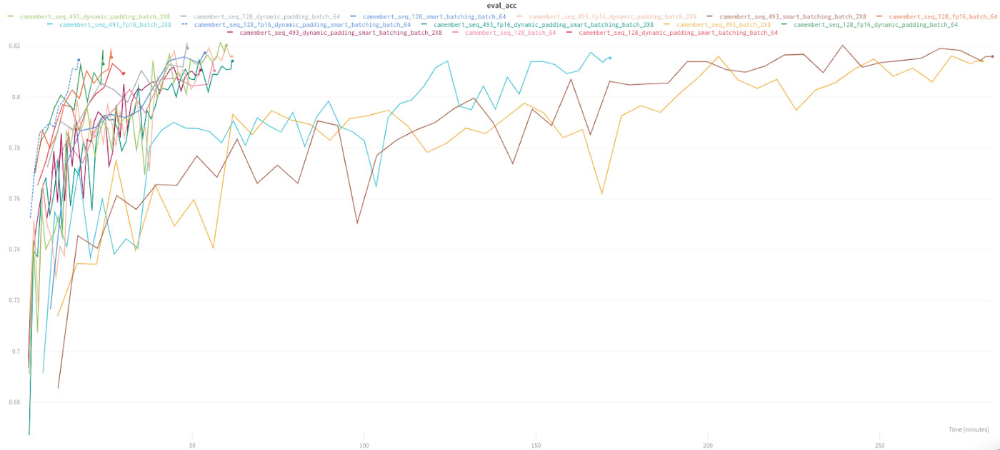
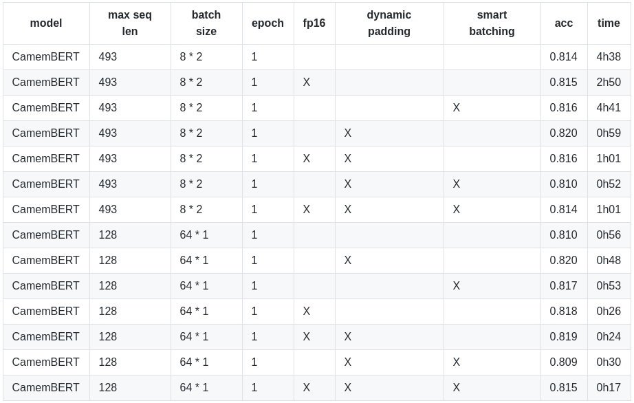
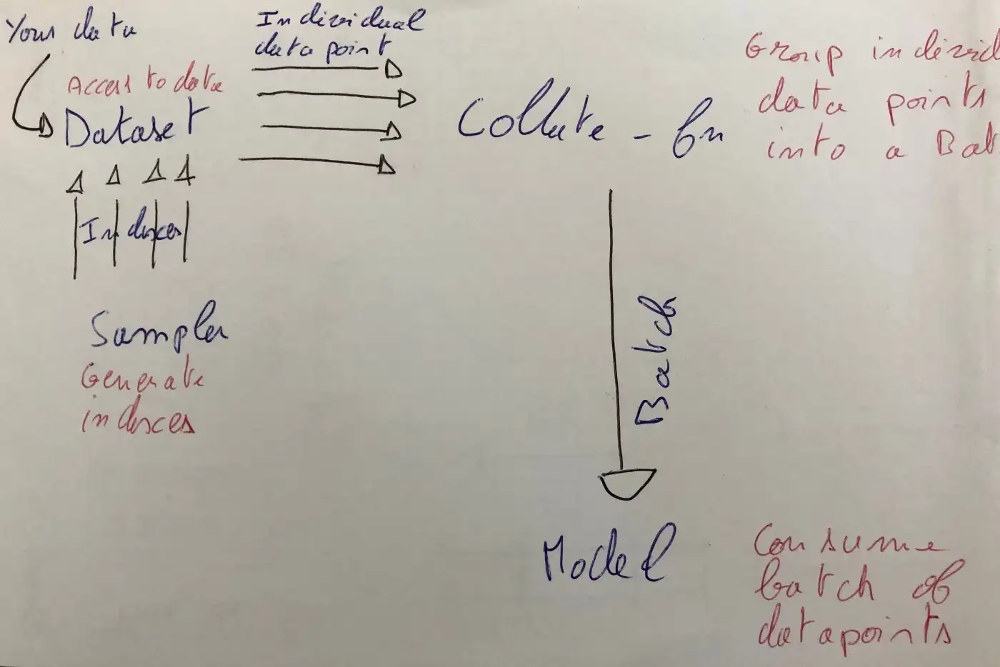
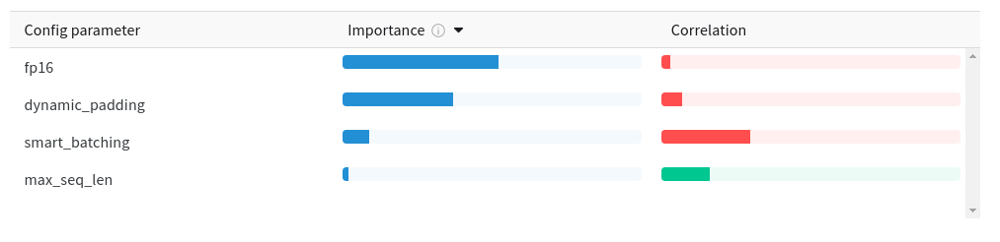
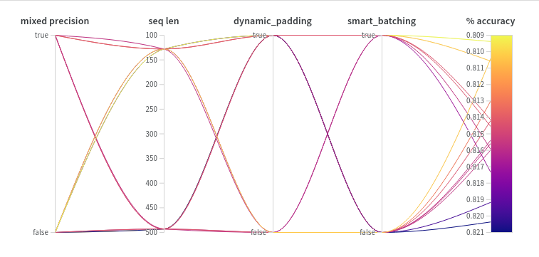
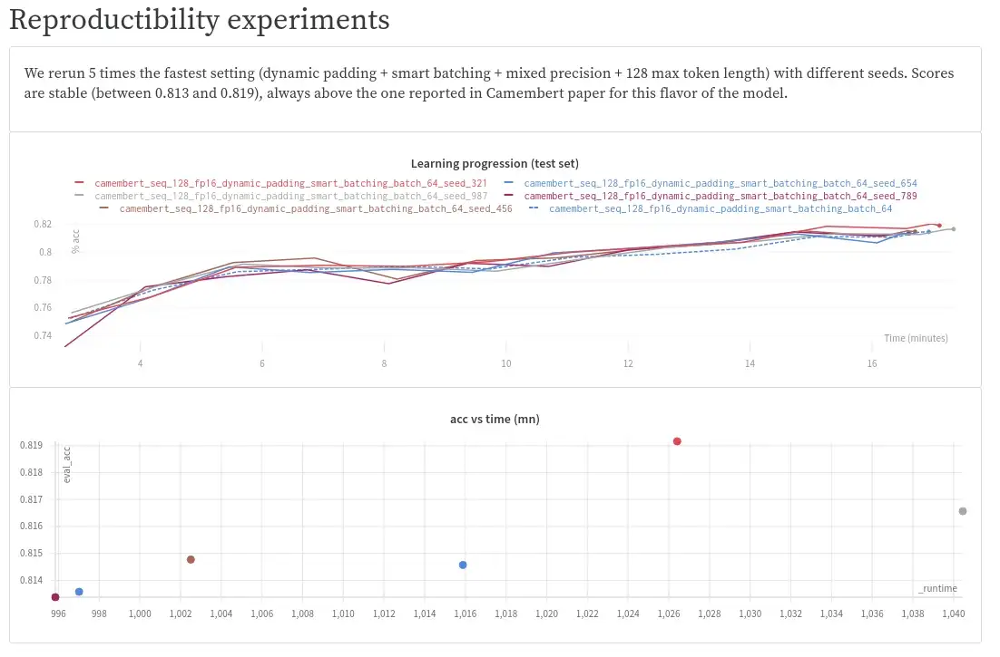

# Divide Hugging Face Transformers training time by 2 or more with dynamic padding and uniform length batching

Reducing training time helps to iterate more in a fixed budget time and thus achieve better results.

<!-- more -->

<figure markdown>
  { width="100%", loading=lazy }
  <figcaption>Photo above is made from <a href="https://www.pngwing.com/en/free-png-ncpgf">this</a> (free for non-commercial use) and <a href="https://www.pexels.com/fr-fr/photo/851989/">that</a> (Pexel licence, free for any use)</figcaption>
</figure>

> _update 06/04/2020: following a suggestion, experiments performed on **large** flavor of CamemBERT have been added to
the [report](https://app.wandb.ai/pommedeterresautee/speed_training/reports/Divide-HuggingFace-Transformers-training-times-by-2-or-more-with-dynamic-padding-and-uniform-length-batching--VmlldzoxMDgzOTI).
TL;DR: training times have been reduced from 4h to 1h30._

I work at [Lefebvre Sarrut](https://www.lefebvre-sarrut.eu/), a publishing company which is a major player in the
European legal industry. As explained in
precedent articles, our needs require us to apply deep learning on very large text datasets (legal case anonymization,
document classification, etc.), that is why we are so interested in making all our (machine learning) tools much faster.

In the spirit of a [precedent article](../../2019/why-we-switched-from-spacy-to-flair/index.md),
the purpose of this one is to explore 2 very simple optimizations which may
significantly decrease training time on [Transformers](https://github.com/huggingface/transformers) library without
negative effect on accuracy. We ran **21 experiments + 12 reproducibility experiments** on a large well-known NLP
dataset (French part of X-NLI), and we show
that by simply using an out-of-the-box French BERT model ([CamemBERT](https://camembert-model.fr/)), default parameters,
a single consumer grade GPU, and these optimizations, for **base** flavor of the model, we can reach, for 128 max token
length, **in a 16 min training an
accuracy of 81.5%, beating by 0.5 points the score obtained with a 56 min training without any optimization**, and
beating by 0.3 points the score reported for this task by the CamemBERT model authors. Gains are even more impressive on
the
same model, for 493 max token length, where training time decreases from 4h38 without any optimization to 1h01 with all
optimizations, still reaching the same score. _Similar training time reduction have been reached with large model (from
4h to 1h30 for 128 tokens length)_.

**Source code** to reproduce the experiments is available [there](https://gist.github.com/pommedeterresautee/1a334b665710bec9bb65965f662c94c8).

> _These optimizations are not task / model / language specific but provided code below is written for Pytorch._
> 
> _If you are interested in this topic, follow me on Twitter: [https://twitter.com/pommedeterre33](https://twitter.com/pommedeterre33)_

<figure markdown>
  { width="100%", loading=lazy }
  <figcaption>Check the <a href="https://app.wandb.ai/pommedeterresautee/speed_training/reports/Decrease-HuggingFace-Transformers-training-times-by-2-or-more-with-dynamic-padding-and-uniform-length-batching--VmlldzoxMDgzOTI">report</a>, just to see how <a href="https://medium.com/u/c4669728a9af?source=post_page-----21bf7129db9e--------------------------------">Weights & Biases</a> is an awesome tool that you don’t know you need</figcaption>
</figure>

Moreover, we logged all our experiments on [Weights & Biases](https://medium.com/u/c4669728a9af?source=post_page-----21bf7129db9e--------------------------------), a kind of
online Tensorboard with a larger scope, so you
can analyze by yourself our experiment results, the report [here](https://app.wandb.ai/pommedeterresautee/speed_training/reports/Decrease-HuggingFace-Transformers-training-times-by-2-or-more-with-dynamic-padding-and-uniform-length-batching--VmlldzoxMDgzOTI).

_(note that “uniform length batching” is named “smart batching” on the report)_

**“Dynamic/variable length padding”** was a thing in NLP in 2017–2018, but now that a single neural network architecture
makes any GPU owner able to reach SOTA scores on almost any task, it seems the NLP community has switched its focus from
finding the optimal batch size to building stuff over the magic architecture. **“Uniform length batching”** is a naive
idea to push dynamic padding gains further that we wanted to check.

<div class="exergues">
    <h2>At the time of this writing, both are not available out of the box on Transformers library for most common tasks.</h2>
</div>

You can find dynamic padding only for text generation/language modeling tasks. Hopefully, we will see that both
techniques are easy to implement on the user side for common tasks (classification, etc.) and we think that most NLP
practitioners should test/use them.

Over the last year, Transformers library from
[Hugging Face](https://medium.com/u/b1574f0c6c5e?source=post_page-----21bf7129db9e--------------------------------)
became the standard way to use large pre-trained language NLP models. It comes with plenty of features covering most NLP
use cases, and has a polished API up to a point where you start to expect it to be perfect. This feeling is even
stronger since [version 2.9](https://github.com/huggingface/transformers/releases/tag/v2.9.0) bringing us the [Trainer](https://github.com/huggingface/transformers/blob/master/src/transformers/trainer.py) class, an adaptation of
the carefully designed
[William Falcon](https://medium.com/u/8536ebfbc90b?source=post_page-----21bf7129db9e--------------------------------)’s 
Pytorch Lightning training API to specific Transformers requirements, which free users from most engineering aspects
of training (Tensorboard logging, mixed precision, gradient accumulation, multi-GPU setup, etc.) and therefore is the
new default way to fine-tune models.

In a situation where everything is so polished, you tend to believe that everything has been optimized to its maximum.
One should not forget that the library is still young, and the team is working on several fronts at the same time 
(recent example being working with
[Tianlei Wu](https://medium.com/u/3f4e5d4653f0?source=post_page-----21bf7129db9e--------------------------------)
from
[Azure DevOps](https://medium.com/u/85d826944fa5?source=post_page-----21bf7129db9e--------------------------------)
to leverage ONNX and [reduce inference times](https://medium.com/microsoftazure/accelerate-your-nlp-pipelines-using-hugging-face-transformers-and-onnx-runtime-2443578f4333)
in some setup). When you go deep inside the library, you may still find some interesting low-hanging fruits to seize.

We ran experiments and summarized what we found below and 
[there](https://app.wandb.ai/pommedeterresautee/speed_training/reports/Decrease-HuggingFace-Transformers-training-times-by-2-or-more-with-dynamic-padding-and-uniform-length-batching--VmlldzoxMDgzOTI).

If you are not yet a “padding / attention mask” expert, you may want to read this excellent 
[article](https://towardsdatascience.com/taming-lstms-variable-sized-mini-batches-and-why-pytorch-is-good-for-your-health-61d35642972e)
written for old style RNN (from
[William Falcon](https://medium.com/u/8536ebfbc90b?source=post_page-----21bf7129db9e--------------------------------)… again!). 
To make it short, training neural networks on a batch of sequences requires them to have the exact same
length to build the batch matrix representation. Because real life NLP datasets are always made of texts of variable
lengths, we often need to make some sequences shorter by truncating them, and some others longer by adding at the end a
repeated fake token called “pad” token. Because the pad token doesn’t represent a real word/subword/signal, when most
computations are done, before computing the loss, we erase the pad token signal by multiplying it by 0 through the
attention mask matrix.

**The main idea behind the 2 optimizations is to avoid as much unused computation as possible:**

- **Dynamic padding**: we limit the number of added pad tokens to reach the length of the longest sequence of each mini
  batch
  instead of a fixed value set for the whole train set. Because the number of added tokens changes across mini batches,
  we
  call it “dynamic” padding ;
- **Uniform length batching**: we push the logic further by generating batches made of similar length sequences, so we
  avoid
  extreme cases where most sequences in the mini batch are short and we are required to add lots of pad tokens to each
  of
  them because 1 sequence of the same mini batch is very long.

Moreover, we check the benefit of a third option, **mixed precision**, what it’s worth alone or combined with the 2
techniques described above.

## Settings

To check if these optimizations work well with a transformer based language model, we ran 14 experiments with different
settings on the French part of [X-NLI](https://arxiv.org/pdf/1809.05053.pdf).

If you don’t know X-NLI, it is basically a sentence pair classification task where the model needs to guess if the
second sentence entails/contradicts/is neutral compared to the first one (3 classes). X-NLI train set is a machine
translation of a large English dataset, and test set is made of 5K pairs manually translated in 15 languages (including
French) from the same English dataset.

The model used for the experiments is [CamemBERT](https://arxiv.org/pdf/1911.03894.pdf), a Roberta architecture
trained with French texts by Facebook FAIR and
Inria labs. Several flavors exist, figures below are related to the first one which have been released and known as
[camembert-base](https://huggingface.co/camembert-base) in Transformers (110M parameters trained on 130 Gb data).
_[camembert-large](https://huggingface.co/camembert-base) experiments are available in
the report._

<figure markdown>
  { width="100%", loading=lazy }
</figure>

> _Camembert paper authors reached an accuracy of 81.2% in 10 epochs with early stopping,1e-5 learning rate, sequence
length of 512 tokens
and [few other things](https://github.com/pytorch/fairseq/blob/master/examples/roberta/README.glue.md)._

For each experiment, we limit training to 1 epoch because we only have access to a single GPU to run all experiments.
All runs are using the same seed (exception being “reproducibility” experiments with different seeds, as explained
below). If not said otherwise, hyper parameters are kept to default values because we do not have the resources to
perform a grid search for each experiment. As we will see, in most experiments we beat the author reported score on
X-NLI, so default settings are probably good enough.

**X-NLI is mainly made of pairs of short sentences:** when both parts of the pair are concatenated in a single sequence,
over 97% of pairs have a length shorter than 128 tokens. This length distribution has a large impact on training time
reduction opportunities. To make it short, on this dataset, it is OK to truncate sequences at 128 tokens to build
“large” batches even on a consumer-grade GPU. On a more balanced dataset like [Ms Marco](http://www.msmarco.org/),
you need a 512-token limit to
reach close to SOTA [Mean Reciprocal Rank](https://en.wikipedia.org/wiki/Mean_reciprocal_rank) (a common information
retrieval measure). In both cases, the 2 techniques
presented here bring large training time reduction (by a factor of 2 or more), but for different reasons that we will
analyze below. In our use of these optimizations on our private datasets, we always got a significant effect on training
times, whatever the characteristic of the dataset.

Time and accuracy are measured on a single Nvidia 2080 TI GPU. Each combination of the 3 optimization options has been
run 2 times, one with a batch of 64 sequences truncated to 128 tokens and a second time with a batch of 16 sequences (2
steps of 8 sequences and a single gradient accumulation) truncated to 493 tokens. 493 is the number of Camembert subword
tokens in the longest sequence in number of characters, and probably one of the longest token sequences in number of
tokens in the train set. The step sizes have been set to the maximum this GPU can take in memory.

Timings include intermediary evaluations (in our case every 500 mini batches) as in real life that’s how most NLP
practitioners run training.

## Results

<figure markdown>
  { width="100%", loading=lazy }
  <figcaption>Accuracy over time for each combination, interactive graph in the report <a href="https://app.wandb.ai/pommedeterresautee/speed_training/reports/Decrease-HuggingFace-Transformers-training-times-by-2-or-more-with-dynamic-padding-and-uniform-length-batching--VmlldzoxMDgzOTI">here</a></figcaption>
</figure>

<figure markdown>
  { width="100%", loading=lazy }
</figure>

TL;DR :

### Timing

- **Dynamic padding used alone provides a significant training time reduction, that can be reinforced by using uniform
  size batching and mixed precision;**
- On some setup (small mini batch size + short sequences), mixed precision can produce a longer training time, in other
  cases it is a game changer (large mini batch size and/or long sequences).

### Accuracy

- **Across the 14 runs, 11 obtained in a single epoch a score above 81.18% (the score reported in the Camembert paper
  for 10 epochs with early stopping);**
- When we compare pairs of runs (same settings with truncation at 128 VS. truncation at 493), it appears unsurprisingly
  that truncation has on average a (small) cost in accuracy, even if only 3% of the dataset is concerned by the
  128-token truncation.

<div class="exergues">
  <h2>By using both optimizations and mixed precision, we beat in a 16mn training the score of a 4h38 training!</h2>
</div>

> _Findings for **base** model are the same for **large** model, measures from the additional 12 experiments are in
the [report](https://app.wandb.ai/pommedeterresautee/speed_training/reports/Divide-HuggingFace-Transformers-training-times-by-2-or-more-with-dynamic-padding-and-uniform-length-batching--VmlldzoxMDgzOTI)._

## Optimization opportunities

### Avoid computations when you are going to throw its result

As explained above, pad token signal is canceled by the application of the attention mask. More pad tokens you put at
the end of a sequence, more unused computations you will perform.

In the Trainer class, you define a (fixed) sequence length, and all sequences of the train set are padded / truncated to
reach this length, without any exception. On X-NLI, shortest sequences are 10 tokens long, if you provide a 128 tokens
length, you will add 118 pad tokens to those 10 tokens sequences, and then perform computations over those 118 noisy
tokens.

> _Worst, as written in
the [original BERT repo README](https://github.com/google-research/bert/blob/master/README.md)_, “…attention is
> quadratic to the sequence length. In other words, a
> batch of 64 sequences of length 512 is much more expensive than a batch of 256 sequences of length 128.”.

A mini batch is made of a small selection of sequences sampled from the dataset. Even when selected randomly in X-NLI,
chances are that the longest sequence in a mini batch is shorter than the maximum sequence length set for the whole
train set. Because the learning / gradient descent is performed at the mini batch level, we have the opportunity to
limit the padding effect, more precisely we can first search for the longest sequence length in the mini batch, and then
pad the other sequences accordingly.

Those operations can be performed in the _collate_fn_ function. The purpose of this function is described in the 
[Pytorch documentation](https://pytorch.org/docs/stable/data.html#working-with-collate-fn), basically it takes the individual
examples returned by the Dataset and merges them to build the tensor
matrix to send to the model.

### Dynamic padding

As explained above, the idea is to adjust the sequence length at the mini batch level instead of dataset level. That way
we can limit unused computation. The work is performed inside the 
[Pytorch Dataloader](https://pytorch.org/docs/stable/data.html). Let’s remind how it works:

<figure markdown>
  { width="100%", loading=lazy }
  <figcaption>Inside a Pytorch Dataloader</figcaption>
</figure>

The components:

- **Dataset()** is the brick having access to the original text data, being a simple list of strings or something else
  like a database connector ;
- **Sampler()** generates indexes to target a datapoint in the Dataset. It follows a strategy, for instance sequential
  generation (for a test set) or random generation (for a train set).
- **collate_fn()** : for each mini batch, it receives the data points (from the Dataset) selected by the Sampler and
  groups
  them in a Tensor (theoretically it can be something else, but usually that’s what you expect as Dataloader output /
  model input).

  _collate_fn_ is the perfect place to perform the dynamic padding. Fortunately, Pytorch Dataloader has a parameter to
  provide our own implementation in its constructor, no need to override anything. Trainer class from Transformers
  library has a similar parameter in its constructor, we will use it. Instead of a function, it waits for an instance of
  a “Collator” (a Transformers specific class) which has a single purpose, wrap the _collate_ method.

Find below a possible implementation of _Collator_ class.

``` py
# ...
def pad_seq(seq: List[int], max_batch_len: int, pad_value: int) -> List[int]:
    # IRL, use pad_sequence
    # https://pytorch.org/docs/master/generated/torch.nn.utils.rnn.pad_sequence.html
    return seq + (max_batch_len - len(seq)) * [pad_value]
@dataclass
class SmartCollator(DataCollator):
    pad_token_id: int
    def collate_batch(self, batch: List[Features]) -> Dict[str, torch.Tensor]:
        batch_inputs = list()
        batch_attention_masks = list()
        labels = list()
        # find the max length of the mini batch
        max_size = max([len(ex.input_ids) for ex in batch])
        for item in batch:
            # apply padding at the mini batch level
            batch_inputs += [pad_seq(item.input_ids, max_size, self.pad_token_id)]
            batch_attention_masks += [pad_seq(item.attention_mask, max_size, 0)]
            labels.append(item.label)
        # expected Transformers input format (dict of Tensors)
        return {"input_ids": torch.tensor(batch_inputs, dtype=torch.long),
                "attention_mask": torch.tensor(batch_attention_masks, dtype=torch.long),
                "labels": torch.tensor(labels, dtype=torch.long)
                }
```

### Does dynamic padding help in decreasing training time?

We run 4 experiments that we group per batch size, for each group we compare cases where dynamic padding is used and
not. When it is enabled for:

- batches of 16 not truncated sequences, timing decreased from 4h39 to 0h59 (-79%) ;
- batches of 64 sequences truncated to 128 tokens, timing decreased from 0h56 to 0h48 (-15%).

Timing decrease is in both cases significant, and is 4X stronger for long sequences. It makes sense, in the train set,
97% of examples are shorter than 128 tokens, so for most of them, we pay a tax for having a 493 max sequence size. By
using the optimization, we pay only for the useful computation.

For 128 tokens truncation, there is still a gain as most sequences are still much smaller than 128 tokens, and BERT
complexity being quadratic regarding its input length, the avoided computation cost is much lower and training time
decreases of “only” 15%.

### Does it impact accuracy?

We run 4 experiments that we group per batch size, for each group we compare cases where dynamic padding is used and
not. When it is enabled for:

- batches of 16 not truncated sequences, accuracy raised from 81.42% to 82.0% ;
- batches of 64 sequences truncated to 128 tokens, accuracy raised from 81.0% to 82.0%.

It appears that accuracy improves with dynamic padding in both cases.

## Uniform size batching

Uniform size batching consists of simply building batches made of similar length sequences. The purpose is to make
padding as minimal as possible when combined with dynamic padding.

There are many ways to implement it, the one we followed was to:

- order examples by length in a simple Python list,
- randomly select an index,
- extract the example and the n examples following (n being the batch/step size),
- delete the extracted examples from the list,
- do it again until there are no more examples in the list.

That way each batch is made of similar length sequences, but following batches are of different lengths.

Naive (simple to understand / not clean) implementation may look something like this:

``` py linenums="1"
def load_train_data(path: str, sort: bool) -> List[Example]:
    sentences = list()
    with open(path) as f:
        first = False
        for line in f:
            if not first:
                first = True
                continue
            text_a, text_b, label = line.rstrip().split("\t")
            lab = len(text_a) + len(text_b)
            sentences.append((lab, Example(text_a=text_a, text_b=text_b, label=label_codes[label])))
    if sort:
        # important operation, we order strings by length
        sentences.sort(key=lambda x: x[0])

    return [e for (_, e) in sentences]


def build_batches(sentences: List[Example], batch_size: int) -> List[Example]:
    batch_ordered_sentences = list()
    while len(sentences) > 0:
        to_take = min(batch_size, len(sentences))
        select = random.randint(0, len(sentences) - to_take)
        batch_ordered_sentences += sentences[select:select + to_take]
        del sentences[select:select + to_take]
    return batch_ordered_sentences


class TextDataset(Dataset):
    def __init__(self, tokenizer: PreTrainedTokenizer, pad_to_max_length: bool, max_len: int,
                 examples: List[Example]) -> None:
        self.tokenizer = tokenizer
        self.max_len = max_len
        self.examples: List[Example] = examples
        self.current = 0
        self.pad_to_max_length = pad_to_max_length

    def encode(self, ex: Example) -> Features:
        encode_dict = self.tokenizer.encode_plus(text=ex.text_a,
                                                 text_pair=ex.text_b,
                                                 add_special_tokens=True,
                                                 max_length=self.max_len,
                                                 pad_to_max_length=self.pad_to_max_length,
                                                 return_token_type_ids=False,
                                                 return_attention_mask=True,
                                                 return_overflowing_tokens=False,
                                                 return_special_tokens_mask=False,
                                                 )
        return Features(input_ids=encode_dict["input_ids"],
                        attention_mask=encode_dict["attention_mask"],
                        label=ex.label)

    def __getitem__(self, _) -> Features:  
    # Trainer doesn't support IterableDataset (define a sampler)
    # so we build a Dataset but we don't respect the index requested
        if self.current == len(self.examples):
            self.current = 0
        ex = self.examples[self.current]
        self.current += 1
        return self.encode(ex=ex)

    def __len__(self):
        return len(self.examples)
    

# ...
train_sentences = load_train_data(path="resources/XNLI-MT-1.0/multinli/multinli.train.fr.tsv",
                                  sort=model_args.smart_batching)
train_batches = build_batches(sentences=train_sentences, batch_size=training_args.per_gpu_train_batch_size)
train_set = TextDataset(tokenizer=tokenizer,
                        max_len=max_sequence_len,
                        examples=train_batches,
                        pad_to_max_length=not model_args.dynamic_padding)
```

## Does uniform size batching really reduce training time?

For time reduction, we previously show that dynamic padding brings large training time reduction, let’s compare training
time with dynamic padding and no uniform size batching, and with both optimizations enabled. For:

- batch of 16 not truncated sequences, training time decreases from 1h01 to 0h52 (-15%) ;
- batch of 64 sequences truncated to 128 tokens, training time decreases from 0h48 to 0h30 (-38%).

So in both situations, our naive idea seems to bring another significant training time decrease.

## Does uniform size batching impact accuracy in any way?

Usually neural networks are trained on randomly ordered data points. Uniform size batching limits this randomness, hence
introduces a kind of bias which may, in theory, impact accuracy.

We will compare the setups with and without the uniform size batching only:

- For a batch of 16 examples when uniform length batching is activated, accuracy increases from 81.4% to 81.6%;
- For a batch of 64 examples, when uniform size batching is activated, accuracy increases from 81.0% to 81.7%.

In both cases, there is an improvement, and we may conclude that there is no negative impact on accuracy.

However, we run many experiments combining several options, and according to the
[Weights & Biases](https://medium.com/u/c4669728a9af?source=post_page-----21bf7129db9e--------------------------------)
dashboard, the use of uniform size batching is negatively correlated with accuracy. After a manual checking of
experiments pairs (with/without the option), this effect is not obvious.

<figure markdown>
  { width="100%", loading=lazy }
</figure>

<figure markdown>
  { width="100%", loading=lazy }
  <figcaption>(if you want to go deeper, do not hesitate to check the <a href="https://app.wandb.ai/pommedeterresautee/speed_training/reports/Decrease-HuggingFace-Transformers-training-times-by-2-or-more-with-dynamic-padding-and-uniform-length-batching--VmlldzoxMDgzOTI">report</a>)</figcaption>
</figure>

## Mixed precision

Mixed precision is possible on Pytorch through the [Nvidia apex library](https://github.com/NVIDIA/apex). To make it
short, in its most common mode, mixed
precision consists of performing most operations with half precision and accumulating results in full precision (more
info in [apex documentation](https://nvidia.github.io/apex/amp.html)).

Apex is known for bringing improvement in some scenarios, sometimes it also brings some instability (e.g., the loss
amplitude during training is bigger than without mixed precision), and quite rarely it avoids the model to converge.
Said otherwise, it’s not a silver bullet, but an interesting tool to test on your case.

The good news is that Trainer class implements it out of the box, to leverage it, you just need to add the right flag to
your command line (“ — fp16”).

Regarding training time for mini batches of 16 long sequences, the situation is unusual. For:

- mixed precision alone makes things better by reducing training time from 4h38 to 2h50 ;
- mixed precision combined with dynamic padding and uniform size batching, it makes training slower, from 0h52 to 1h01!

The reason is probably that in the second case, it adds overhead and doesn’t help that much as most batches are only
made of short sequences. Mixed precision helps the most with big matrix operations.

When applied to mini batches of 64 short sequences, things are as expected:

- Used alone, time training decreases from 0h56 to 0h26
- Combined with the 2 other options, time decreases from 0h30 to 0h17

This time, even when the step is made of short sequence, each contains 64 sequences, making the matrix big enough to
benefit from mixed precision.

Regarding accuracy, there is no clear pattern. You can make your own idea by yourself by checking the
[Weights & Biases](https://medium.com/u/c4669728a9af?source=post_page-----21bf7129db9e--------------------------------)
[report](https://app.wandb.ai/pommedeterresautee/speed_training/reports/Decrease-HuggingFace-Transformers-training-times-by-2-or-more-with-dynamic-padding-and-uniform-length-batching--VmlldzoxMDgzOTI).

## Reproducible results

All experiments have been run using the same seed. It may happen that we were lucky and our approach was hitting
accuracy but not with this seed and on this dataset.

We reran the 16 min training with all optimizations enabled setting 5 times with different seeds and accuracy / timing
are reproduced.

> _Same kind of reproduction experiments have been also performed for the large model. Results are the same._

<figure markdown>
  { width="100%", loading=lazy }
  <figcaption>Again, want interactive graph? -> <a href="https://app.wandb.ai/pommedeterresautee/speed_training/reports/Decrease-HuggingFace-Transformers-training-times-by-2-or-more-with-dynamic-padding-and-uniform-length-batching--VmlldzoxMDgzOTI">report</a> <-</figcaption>
</figure>

## A conclusion?

**We have shown that both techniques constantly provide significant time reduction without reducing accuracy**.
Moreover, we learned that on a dataset with small batches, one should be careful with mixed precision, because it can
lead to unexpected slower training if there is not enough computation to perform.

<div class="exergues">
  <h2>We are convinced that both techniques are low-hanging fruits that should be widely used by Transformers users.</h2>
</div>

To finish on a more general thought, we are pleasantly surprised by the results obtained by such simple ideas. Just for
the story, in another unrelated experiment, we noticed that the French train set of X-NLI (which is a machine
translation of an english dataset) was of low quality (many examples are absolute nonsense in French), and we were
wondering if translating it with a better quality would improve the accuracy on the test set (which is a manual
translation). It represented an important opportunity to us, because if it worked it would mean having plenty of dataset
in French to play with. We spent a few bucks on DeepL, the translation was much better… and the accuracy didn’t change 
(we even thought there was a bug in our measures). **Not all simple ideas are created equal!**
