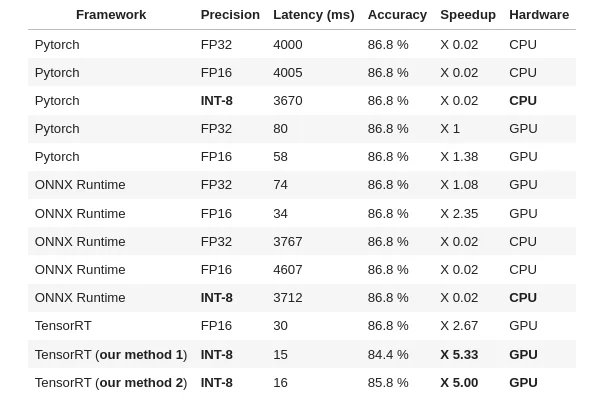

# 1st ever method to perform *GPU* quantization on most 🤗 HF transformer models: > 2X faster inference!

Quantization is a technique to significantly accelerate inference by replacing high precision tensors by lower precision
representation in a way where accuracy is kept intact (or close to).

It’s quite common in CPU inference, a lot less on GPU, even if the performance boost is significant.

<!-- more -->

End-to-end method (we also added many other
benchmarks): [https://github.com/ELS-RD/transformer-deploy/blob/main/demo/quantization/quantization_end_to_end.ipynb](https://github.com/ELS-RD/transformer-deploy/blob/main/demo/quantization/quantization_end_to_end.ipynb)

The library repo (Apache 2
licence): [https://github.com/ELS-RD/transformer-deploy](https://github.com/ELS-RD/transformer-deploy)

To give you an idea of the latency speed up:

<figure markdown>
  { width="100%", loading=lazy }
  <figcaption>Roberta-base (classification, MNLI) latency benchmark - batch 32, seq len 256</figcaption>
</figure>

AFAIK 3 methods of GPU quantization exist for the 2018 vanilla Bert architecture (2 from Nvidia and 1 from Microsoft)
but none exist for any other architecture (Roberta, Electra, DistillBert, Deberta, etc.) limiting the benefit of GPU
quantization to old models. We hope that this project will help generalisation of quantization in NLP and ease NLP big
models deployment.

It’s a big deal as quantization is rarely used on GPU (unlike CPU) because it requires some Nvidia tools not well known
from most ML practitioners (like TensorRT). In the lib we have wrapped those tools so they are transparent to the final
user.

The result is a model that is **_always several times faster_** than vanilla Pytorch on GPU on any batch size / seq
length for
any transformer flavour (small, base, large, XX-large, etc.).

This work is based on a very recent model (QDQBert -> 2018 vanilla Bert which supports quantization) added by Nvidia to
the Hugging Face transformer library a few weeks ago.

Next to the generic method we have developed, we have also implemented in the lib a new model as a proof of concept,
QDQRoberta (and no, Roberta is not identical to Bert!). Of course the idea is to extend the process to all transformer
architectures (there are not that many).

**Both approaches offer different trade-offs in generalisation and accuracy** (details in the notebook).

There are many things which are still to be experimented, for instance for QDQRoberta (and other future QDQ models), is
Roberta source code (almost trivial) modification a good idea? Should we just patch ONNX files like Microsoft does? Or
build from scratch the graph directly in TensorRT like Nvidia does? Or leverage the new Pytorch FX interface? All
approaches should, in theory, lead to the same result (accuracy/speed), but offer different ease of use (final user) VS
ease of maintainability (library maintainer) trade-offs.

**GPU quantization is not very discussed/known in NLP, so please don’t hesitate to comment/ask questions below, so we
can
improve the tuto and democratize GPU quantization.**