# Hugging Face Transformer Inference Under 1 Millisecond Latency

Go to production with Microsoft and Nvidia open source tooling

<!-- more -->

<figure markdown>
  { width="100%", loading=lazy }
  <figcaption>“Oh my fur and whiskers! I’m late, I’m late, I’m late!” (from <a href="https://commons.wikimedia.org/wiki/File:The_White_Rabbit_(Tenniel)_-_The_Nursery_Alice_(1890)_-_BL.jpg">https://commons.wikimedia.org/wiki/File:The_White_Rabbit_(Tenniel)_-_The_Nursery_Alice_(1890)_-_BL.jpg</a>, <a href="https://en.wikipedia.org/wiki/en:Creative_Commons">Creative Commons</a>] CC0 1.0 Universal Public Domain Dedication)</figcaption>
</figure>

Recently, 🤗 Hugging Face (the startup behind the [transformers](https://github.com/huggingface/transformers) library)
released a new product called “Infinity’’. It’s [described](https://huggingface.co/infinity) as a server to perform
inference at “enterprise scale”. A [public demo](https://www.youtube.com/watch?v=jiftCAhOYQA) is available on YouTube 
(find below screenshots with timings and configuration used during the demo). The communication is around the promise
that the product can perform Transformer inference at 1 millisecond latency on the GPU. According to the demo presenter,
Hugging Face Infinity server costs at least 💰20 000$/year for a single model deployed on a single machine (no
information is publicly available on price scalability).

It made me curious to dig a bit and check **if it was possible to reach those performances with the same AWS
VM/model/input that used in the demo** (see screenshot below for details), using open source tooling from Microsoft and
Nvidia? **Spoiler: yes it is and with this tutorial, it’s easy to reproduce and adapt to your REAL LIFE projects**.

> _💻 The project source code is available at this address:_
>
> _[https://github.com/ELS-RD/transformer-deploy](https://github.com/ELS-RD/transformer-deploy)_
>
> _The README provides instructions on how to run the code and has been tested both on an AWS VM with deep learning
image version 44 and a bare metal server with a Nvidia 3090 GPU (measures published in the article are from the AWS
machine)._

<figure markdown>
  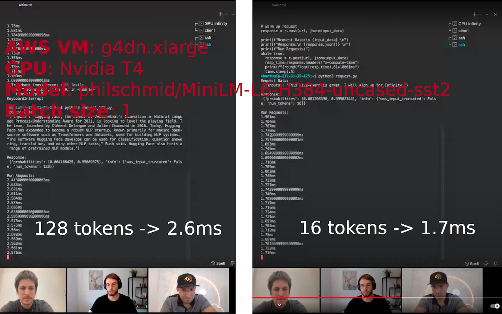{ width="100%", loading=lazy }
  <figcaption>Quite stable measures performed during the public demo for 2 input sizes (from <a href="https://www.youtube.com/watch?v=jiftCAhOYQA">https://www.youtube.com/watch?v=jiftCAhOYQA</a>, screenshots by the author)</figcaption>
</figure>

I work at [Lefebvre Sarrut](https://www.lefebvre-sarrut.eu/) R&D, a leading European legal publisher, and my team has
deployed quite a bunch of models in
production, including several transformers, from small distilled models to large ones, to perform a variety of tasks on
legal documents. Some of these works have been
described [here](https://towardsdatascience.com/why-we-switched-from-spacy-to-flair-to-anonymize-french-legal-cases-e7588566825f)
and [there](../../2019/ner-algo-benchmark-spacy-flair-mbert-camembert/index.md).

In this article we will see how to deploy a modern NLP model in an industrial setup. Dozens of tutorials exist on the
subject, but, as far as I know, they are not targeting production, and don’t cover performance, scalability , decoupling
CPU and GPU tasks or GPU monitoring. Some of them look like: 1/ take FastAPI HTTP server, 2/ add Pytorch, and voilà 🤪

> _If you have_ interesting _content you want me to link to, please post in comments…_

The purpose of this tutorial is to explain how to heavily optimize a Transformer from Hugging Face and deploy it on a
**production-ready** inference server, end to end. You can find some interesting and technical content from Nvidia and
Microsoft about some specific parts of this process.

The closest match and an inspiration for me
is [this article](https://medium.com/nvidia-ai/how-to-deploy-almost-any-hugging-face-model-on-nvidia-triton-inference-server-with-an-8ee7ec0e6fc4).
It still misses 2 critical points, significant optimization and tokenization on inference server side (otherwise you
can’t _easily_ call the inference server outside of Python). We will cover those 2 points.

The performance improvement brought by this process applies to all scenarios, from short sequences to long ones, from a
batch of size 1 to large batches. When the architecture is compliant with the expectations of the tools, the process
always brings a significant performance boost compared to vanilla PyTorch.

The process is in **3 steps**:

- **Convert** Pytorch model to a graph
- **Optimize** the graph
- **Deploy** the graph on a performant inference server

At the end we will compare the performance of our inference server to the numbers shown by Hugging Face during the demo
and will see that **we are faster for both 16 and 128 tokens input sequences with batch size 1** (as far as I know,
Hugging Face has not publicly shared information on other scenarios).

More importantly, more machine learning practitioners will be able to do something far more reliable than deploying an
out of the box Pytorch model on non-inference dedicated HTTP server.

## From Pytorch to ONNX graph

You probably know it, the big selling point of Pytorch compared to Tensorflow 1.X has been its ease of use: instead of
building a graph you just write familiar imperative code. It feels like you are writing numpy code running at GPU speed.

Making users happy is awesome, what is even more awesome is to also make optimization tools happy. Unlike humans, those
tools love graphs to perform (sometimes offline) analysis. It makes sense, graphs provide a static and complete view of
the whole process, from data point to model output. Moreover, the graph provides an intermediate representation which
may be common to several machine learning frameworks.

We need a way to convert our imperative Pytorch code to a graph. Several options exist, but the one we are interested in
is called ONNX. _“ONNX is an open format built to represent machine learning models. ONNX defines a common set of
operators — the building blocks of machine learning and deep learning models — and a common file format to enable AI
developers to use models with a variety of frameworks, tools, runtimes, and
compilers.”_ ([https://onnx.ai/](https://onnx.ai/)). The format
has initially been created by Facebook and Microsoft to have a bridge between Pytorch (research) and Caffee2 (production).

Pytorch includes an export to ONNX tool. The principle behind the export tool is quite simple, we will use the “tracing”
mode: we send some (dummy) data to the model, and the tool will trace them inside the model, that way it will guess what
the graph looks like.

Tracing mode is not magic, for instance it can’t see operations you are doing in numpy (if any), the graph will be
static, some if/else code is fixed forever, for loop will be unrolled, etc. It’s not a big deal because Hugging Face and
model authors took care that main/most models are tracing mode compatible.

For your information, there is another export mode called “scripting” which requires the models to be written in a
certain way to work, its main advantage is that the dynamic logic is kept
intact [but it would have added too many constraints in the way models are written for no obvious performance gain](https://github.com/huggingface/transformers/pull/6846#issuecomment-690363367).

Following commented code performs the ONNX conversion:

<figure markdown>
  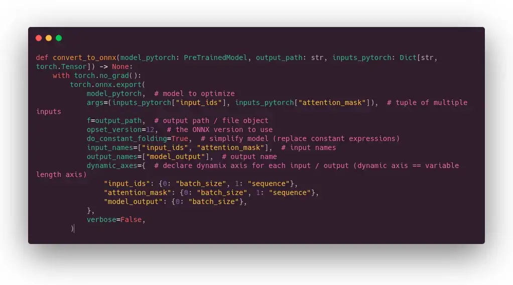{ width="100%", loading=lazy }
  <figcaption>Pytorch to ONNX conversion code (Image by Author)</figcaption>
</figure>

One particular point is that we declare some axis as dynamic. If we were not doing that, the graph would only accept
tensors with the exact same shape that the ones we are using to build it (the dummy data), so sequence length or batch
size would be fixed. The name we have given to input and output fields will be reused in other tools.

> _Please, note that ONNX export also works for feature extraction like done in sentence-transformers library but in
that case it requires some little tricks._

🥳 _Félicitations_, you know how to have a graph ready to be optimized!

## Graph optimization: 2 tools, 1 mission

We will focus on 2 tools to optimize Pytorch models: [ONNX Runtime](https://onnxruntime.ai/) from Microsoft (open source
under MIT license) and
[TensorRT](https://developer.nvidia.com/tensorrt) from Nvidia (open source under Apache 2 license, the optimization
engine is closed source).

They can work alone or together. In our case, we will use them together, meaning using TensorRT through ONNX Runtime
API.

> _> #protip: if you want to sound like a MLOps, don’t say ONNX Runtime / TensorRT, but ORT and TRT. Plus you may find
those names in Github issues/PR._

Both tools perform the same kind of operations to optimize ONNX model:

- **find and remove operations that are redundant**: for instance dropout has no use outside the training loop, it can
  be
  removed without any impact on inference;
- **perform constant folding**: meaning find some parts of the graph made of constant expressions, and compute the
  results at
  compile time instead of runtime (similar to most programming language compiler);
- **merge some operations together**: to avoid 1/ loading time, and 2/ share memory to avoid back and forth transfers
  with the
  global memory. Obviously, it will mainly benefit to memory bound operations (like multiply and add operations, a very
  common pattern in deep learning), it’s called “kernel fusion”;

They can optionally convert model weights to lighter representations once for all (from 32-bit float to 16-bit float or
even 8-bit integers in case of quantization).

[Netron](https://github.com/lutzroeder/netron) can produce display of ONNX graph before and after optimization:

<figure markdown>
  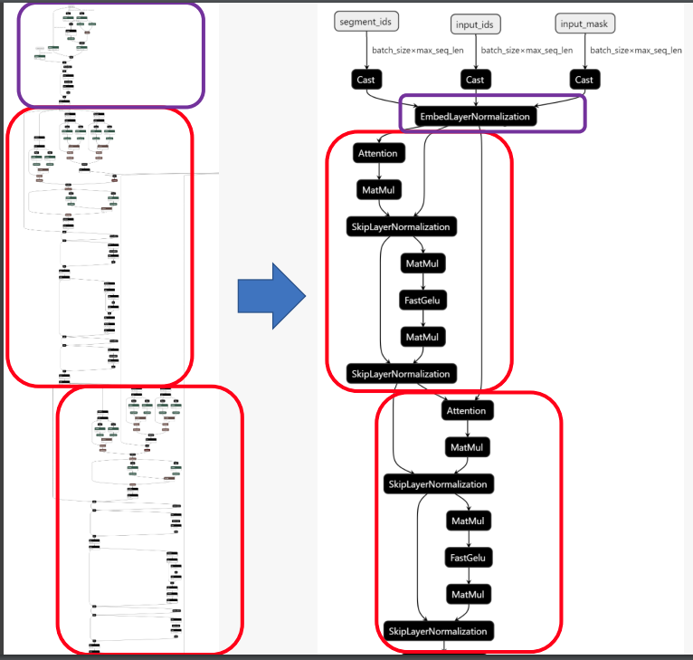{ width="100%", loading=lazy }
  <figcaption>From  <a href="https://wiki.lfaidata.foundation/download/attachments/22249690/2.3%202020_Apr_ONNX%20MEETUP_ORT%20breakthrough%20optimizations%20for%20transformer%20inference%20on%20GPU%20and%20CPU.pdf?version=1&modificationDate=1586564917000&api=v2">ONNX Runtime — Breakthrough optimizations for transformer inference on GPU and CPU</a></figcaption>
</figure>

Both tools have some fundamental differences, the main ones are:

- **Ease of use**: TensorRT has been built for advanced users, implementation details are not hidden by its API which is
  mainly C++ oriented (including the Python wrapper which works exactly the way the C++ API does, it may be surprising
  if you are not a C++ dev). On the other hand, ONNX Runtime documentation is easy to understand even if you are not a
  machine learning hardware expert, offers a Pythonic API plus many examples in this language, and you will find more
  NLP dedicated examples and tools.
- **Scope of optimizations**: TensorRT usually provides the best performance. The process is slightly tricky, I won’t
  provide details here, but basically you build “profiles” for different associations of hardware, model and data
  shapes.
  TensorRT will perform some benchmark on your hardware to find the best combination of optimizations (a model is
  therefore linked to a specific hardware). Sometimes it’s a bit too aggressive, in particular in mixed precision, the
  accuracy of your
  transformer model may drop. To finish, let’s add that the process is non-deterministic because it depends on kernel
  execution time. To make it short, we can say that the added performance brought by TensorRT has a learning curve cost.
  ONNX Runtime has 2 kinds of optimizations, those called “on-line” which are automagically applied just after the model
  loading (just need to use a flag), and the “offline” ones which are specific to some models, in particular to
  transformer based models. We will use them in this article. Depending on the model, the data and the hardware, ONNX
  Runtime + offline optimizations are sometimes on par with TensorRT, other times I have seen TensorRT up to 33% faster
  on real scenarios. TensorRT API is more complete than what is exposed through ONNX Runtime, for instance you can tell
  which tensor shape is optimal, and fix some limits on dimensions, therefore it will generate all required profiles.
  **If you *really* need best performances, you need to learn TensorRT API**.
- **Multiple backends**: ONNX Runtime has its own CUDA and CPU inference engines, but it can also delegate the inference
  to third party backends… including TensorRT, TVM or openVINO! In those cases, ONNX Runtime is a nice and
  well-documented
  API to leverage a more complex tool. You know what? We will test that below!
- Multiple hardware targets: TensorRT is dedicated to Nvidia hardware (many GPUs and Jetson), ONNX Runtime targets GPU 
  (Nvidia CUDA and AMD RocM), CPU, edge computing including browser deployment, etc.

<div class="exergues">
  <h2>In case you didn’t get it, ONNX Runtime is your good enough API for most inference jobs.</h2>
</div>  

Regarding the transformer architectures supported, you can have a basic idea of what ONNX Runtime is capable of by
checking [this page](https://github.com/microsoft/onnxruntime/blob/master/onnxruntime/python/tools/transformers/huggingface_models.py).
It includes Bert, Roberta, GPT-2, XLM, layoutlm, Bart, T5, etc. Regarding TensorRT, I have tried
many architectures without any issue, but as far as I know, there is no list of tested models. At least you can find T5
and GPT-2 notebooks [there](https://github.com/NVIDIA/TensorRT/tree/main/demo/HuggingFace), with up to X5 faster
inference compared to vanilla Pytorch.

According to this [README](https://github.com/NVIDIA/TensorRT/tree/main/demo/HuggingFace/NNDF), Nvidia is working
hard to ease transformers acceleration on its framework and this is great
news for all of us!

## Offline optimizations

As said previously, some optimizations are applied just after loading the model in memory. There is also the possibility
to apply some deeper optimizations while performing a static analysis of the graph, so that it will be easier to manage
the dynamics axis or drop some unnecessary casting nodes. Moreover, changing model precision (from FP32 to FP16)
requires being offline. Check
this [guide](https://github.com/microsoft/onnxruntime/blob/master/onnxruntime/python/tools/transformers/Dev_Guide.md) to
learn more about those optimizations.

ONNX Runtime offers such things in
its [tools folder](https://github.com/microsoft/onnxruntime/tree/master/onnxruntime/python/tools/transformers). Most
classical
transformer architectures are supported, and it includes miniLM. You can run the optimizations through the command line:

``` shell
python -m onnxruntime.transformers.optimizer ...
```

In our case, we will perform them in Python code to have a single command to execute. In the code below, we enable all
possible optimizations plus perform a conversion to float 16 precision.

<figure markdown>
  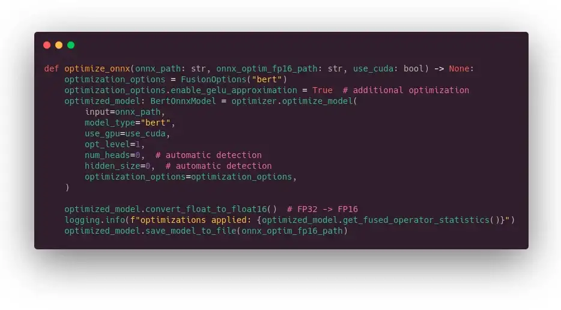{ width="100%", loading=lazy }
  <figcaption>ONNX Runtime offline optimization code (Image by Author)</figcaption>
</figure>

A part of the performance improvement comes from some approximations performed at the CUDA level: on the activation
layer (GELU) and on the attention mask layer. Those approximations can have a small impact on the model outputs. In my
experience, it has less effect on the model accuracy than using a different seed during training.

Regarding TensorRT, there are no offline optimizations but it’s advised
in [ONNX Runtime documentation](https://onnxruntime.ai/docs/execution-providers/TensorRT-ExecutionProvider.html#samples)
to perform symbolic shape inference on the vanilla ONNX model. This is useful because it may happen that ONNX Runtime
splits the graph in several subgraphs, and because of that the (tensor) shape information is lost for TensorRT. Symbolic
shape inference will put back the information everywhere it’s required. And if like me, you are wondering why it’s
called symbolic, it’s because it will really perform symbolic computation with a Python lib called [sympy
](https://www.sympy.org/en/index.html) dedicated to… symbolic computation in general.

<figure markdown>
  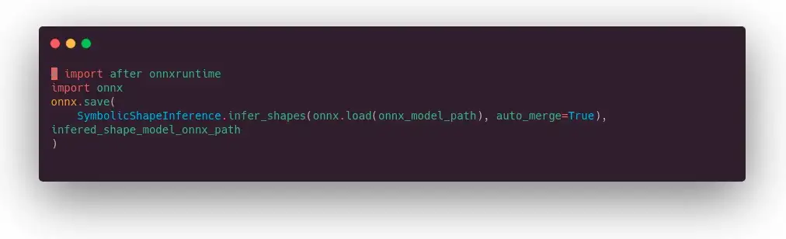{ width="100%", loading=lazy }
  <figcaption>ONNX shape inference code (Image by Author)</figcaption>
</figure>

## A word about GPU int-8 quantization

CPU quantization works out of the box, GPU is another story. You may have seen benchmarks from Nvidia showing amazing
performances with int-8 quantization compared to FP16 precision and may wonder, why you can’t find any NLP tutorial to
do the same (in CV there is quite a bit).

There are several reasons why :

- First, transformers quantization has been fully enabled since TensorRT 8, which was released last summer.
- Second, the existing tooling (the one I tried at least) is buggy, the documentation is not always up to date, and it
  doesn’t work well with the last version of Pytorch (I experienced an issue to export graph including QDQ nodes).
  Still, if you dig a bit in Pytorch code, you can work around the bug with a dirty patch.
- Third, the results are hardware dependent, meaning lots of experimentations for different shapes/models/hardware
  associations.
- Fourth, depending on your quantization approach, it can make your model slower than in FP16 by adding plenty of
  “reformatting” nodes.

Quantization brings its best performance with large flavors of transformer architectures because, beyond the reduction
of calculations, it reduces memory transfers of its many weights in a way that no kernel fusion can reach.

Another thing to keep in mind is that not all models can be int-8 quantized out of the box, sometimes you will get some
“Could not find any implementation for node …” error message meaning you are good to rework the model, wait for a new
version of TensorRT, or, if you have lots of free time, fork TensorRT
like [here](https://paulbridger.com/posts/tensorrt-object-detection-quantized/). Vanilla Bert works well. miniLM works
on some tools, but not all, not sure why.

Not all layers should be quantized. Post training quantization quantizes all layers and is performance focused (but
accuracy may drop), it’s up to the user to choose the layers he wants to exclude to keep high accuracy. Query aware
training only quantize specific layers, in Bert case you will find attention layers for instance, therefore it’s usually
a trade-off between accuracy and performance.

To finish, calibration (a required operation to convert floats to integers and a scale) is still an unsolved problem,
there are several options and you need again to experiment to find the ones which works for your model and your task.

> _For more information on quantization, you can check this very good paper from
Nvidia: [https://arxiv.org/abs/2004.09602](https://arxiv.org/abs/2004.09602)_

When you are working at internet scale like
Microsoft, [it makes sense to invest in this technology](https://blogs.bing.com/Engineering-Blog/october-2021/Bing-delivers-more-contextualized-search-using-quantized-transformer-inference-on-NVIDIA-GPUs-in-Azu).
For most of us, it’s not obvious until the software part is improved.

## ⌛Inference benchmarks (local execution)

Ok, now it’s time to benchmark. For that purpose we will use a simple decorator function to store each timing. The rest
of the code is quite straightforward. **Measures at the end of the script are performed with 16 tokens input (like one
of the measures in the Infinity demo)**.

<figure markdown>
  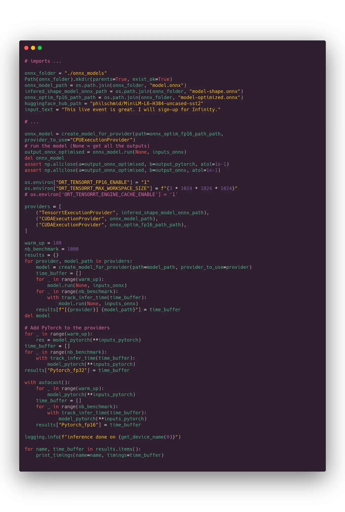{ width="100%", loading=lazy }
  <figcaption>Inference benchmark code (Image by Author)</figcaption>
</figure>

Results below:

<figure markdown>
  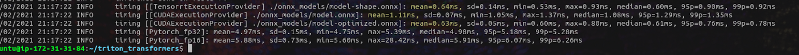{ width="100%", loading=lazy }
  <figcaption>Measures for each ONNX Runtime provider for 16 tokens input (Image by Author)</figcaption>
</figure>

> _💨 **0.64 ms** for TensorRT (1st line) and 0.63 ms for optimized ONNX Runtime (3rd line), it’s close to 10 times
faster than vanilla Pytorch! **We are far under the 1 ms limits**._

We are saved, the title of this article is honored :-)

It’s interesting to notice that on Pytorch, 16-bit precision (5.9 ms) is slower than full precision (5 ms). This is due
to our input, there is no batching, the sequence is very short, and at the end of the day, the casting from FP32 to FP16
adds more overhead than the computation simplification it implies.

> _Of course we have checked that **all model outputs are similar** (they won’t be equal because of small approximation,
as explained above, plus different backend performs rounding inside the graph slightly differently)._

Outside of benchmarks or corner case use cases, it’s not every day that you perform inference on a single 16 sequence
tokens on a very small model on a GPU because it doesn’t take advantage of GPU main strength. Moreover, even if your
queries come as single sequence, most serious inference servers have a feature to combine individual inference requests
together in batches. The purpose is to exchange few milliseconds of latency against an increased throughput, which may
be what you are looking for when you try to optimize your hardware total cost of ownership.

**Just for your information and not related to the Hugging Face demo**, please find below measures on the same virtual
machine (T4 GPU) for `bert-base-uncased`, sequence of 384 tokens and batch of size 32 (those are common parameters we
are
using in our use cases at Lefebvre Sarrut):

<figure markdown>
  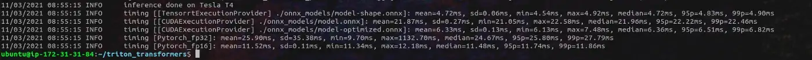{ width="100%", loading=lazy }
  <figcaption>Performance on bert-base-uncased with large batch of data (Image by Author)</figcaption>
</figure>

As you can see, the latency decrease brought by TensorRT and ONNX Runtime are quite significant, **ONNX Runtime+TensorRT
latency (4.72 ms) is more than 5 times lower than vanilla Pytorch FP32 (25.9 ms) ⚡️🏃🏻💨💨 !** With TensorRT, at percentile
99, we are still under the 5 ms threshold. As expected, here FP16 on Pytorch is approximately 2 times faster than FP32
as and ONNX Runtime alone (CUDA provider) performs a good job quite similar to TensorRT provider.

These results should not surprise us as it seems we are using the same tooling than Hugging Face.

<!--image is missing-->

## 🍎 vs 🍎: 1st try, ORT+FastAPI vs Hugging Face Infinity

It wouldn’t be fair to compare the timings from the precedent section with those from the Hugging Face demo: we have no
server communication, no tokenization, no overhead at all, we just perform the inference.

So, we will do it again, but this time with a simple HTTP server: FastAPI (like in the dozens of marketing content you
can find on AI startup blogs).

> _Please note that, whatever its performance, FastAPI is not a good inference server choice to go on production, it
misses basic things like GPU monitoring, advanced ML performance tooling, etc._


<figure markdown>
  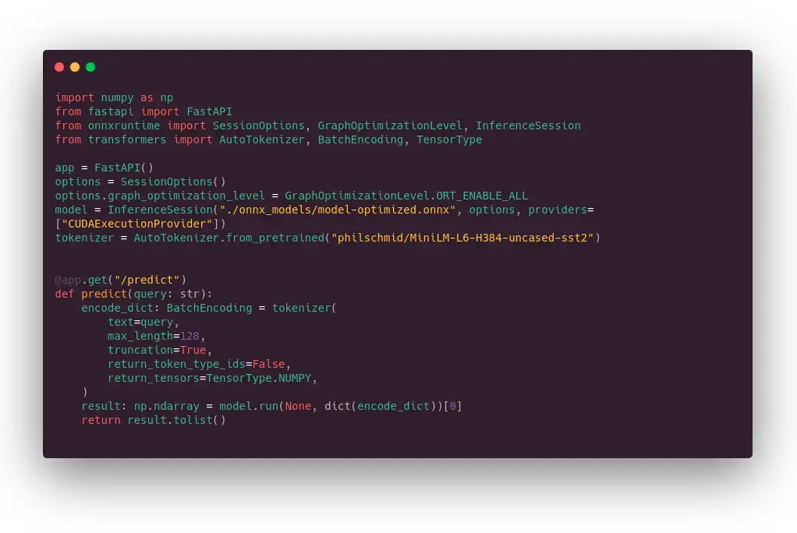{ width="100%", loading=lazy }
  <figcaption>At least, it was easy to write :-) (Image by Author)</figcaption>
</figure>

The timing looks like that:

<figure markdown>
  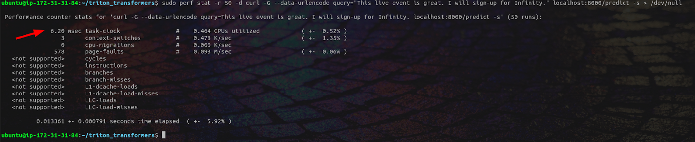{ width="100%", loading=lazy }
  <figcaption>Simple benchmark ONNX Runtime + FastAPI benchmark (similar measures if you replace curl by requests library) (Image by
Author)</figcaption>
</figure>

**[sarcasm on]** Whhhhhhhaaaaaat???? Performing the inference inside fastAPI is 10 times slower than local inference?
What a
surprise, who would have expected that? **[sarcasm off]**

If we check on
a [well-known web framework benchmark](https://www.techempower.com/benchmarks/?utm_source=pocket_mylist#section=data-r20&hw=ph&test=db),
we can see that FastAPI is not that fast compared to other options from other languages. It’s even among the slowest on
the single query latency side (over 38X slower than fasthttp Go server). It doesn’t make it a bad software, of course,
it’s really a nice tool to use with its automatic typing, etc., but it’s not what we need here.

> _Hugging Face has only communicated on very short (16) and short (128) sequences with batch size of 1. The model is
optimizable with off-the-shelf tooling, but the end to end performance is not reachable if we stay in the Python world.
**In some other scenario (large batch, long sequence), few milliseconds overhead difference may have been insignificant**._

So, what do we use if not fastAPI?

## 🍎 vs 🍎: 2nd try, Nvidia Triton vs Hugging Face Infinity

Nvidia has released a beautiful inference server called [Triton](https://github.com/triton-inference-server/server) 
(formerly known as TensorRT which was very confusing).

It offers close to everything you may need, GPU monitoring, nice documentation, the best error messages I have ever
seen (seriously, it’s like they put someone inside to tell you what to fix and how). It has plenty of very powerful
possibilities (that we won’t detail in this already too long tutorial) and is still easy to use for simple cases. It
provides a GRPC plus a HTTP API, quite a performant client for Python (requests library is like FastAPI, simple API,
close to perfect documentation, but so-so performances) and a good C++ one. It comes with a bunch of serious tools to
optimize hardware usage. To better understand what makes a good inference engine,
check [https://arxiv.org/pdf/2011.02327.pdf](https://arxiv.org/pdf/2011.02327.pdf)

For reasons I don’t get, it’s not a very well-known tool in the NLP community (the situation is a bit better in the CV
community).

### 1/ Setting up the ONNX Runtime backend on Triton inference server

Inferring on Triton is simple. Basically, you need to prepare a folder with the ONNX file we have generated and a config
file like below giving a description of input and output tensors. Then you launch the Triton Docker container… and
that’s it!

Here the configuration file:

<figure markdown>
  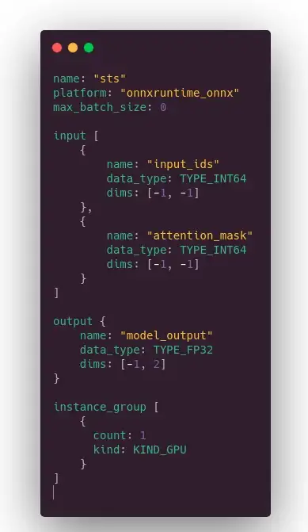{ width="100%", loading=lazy }
  <figcaption>It smells like a json but it isn’t (Image by Author)</figcaption>
</figure>

2 comments:

- **max_batch_size**: 0 means no dynamic batching (the advanced feature to exchange latency with throughput described
  above).
- **-1** in shape means dynamic axis, aka this dimension may change from one query to another

### 2/ Setting up the client

In the repo associated with this article (link at the beginning), there are 2 Python client scripts, one based on the
[tritonclient](https://github.com/triton-inference-server/client) library (performant), one based on requests
library (not performant but useful as a draft if you need to call Triton outside Python) and a simple curl call (in the
repository README).

Our tritonclient based script to query Triton inference server:

<figure markdown>
  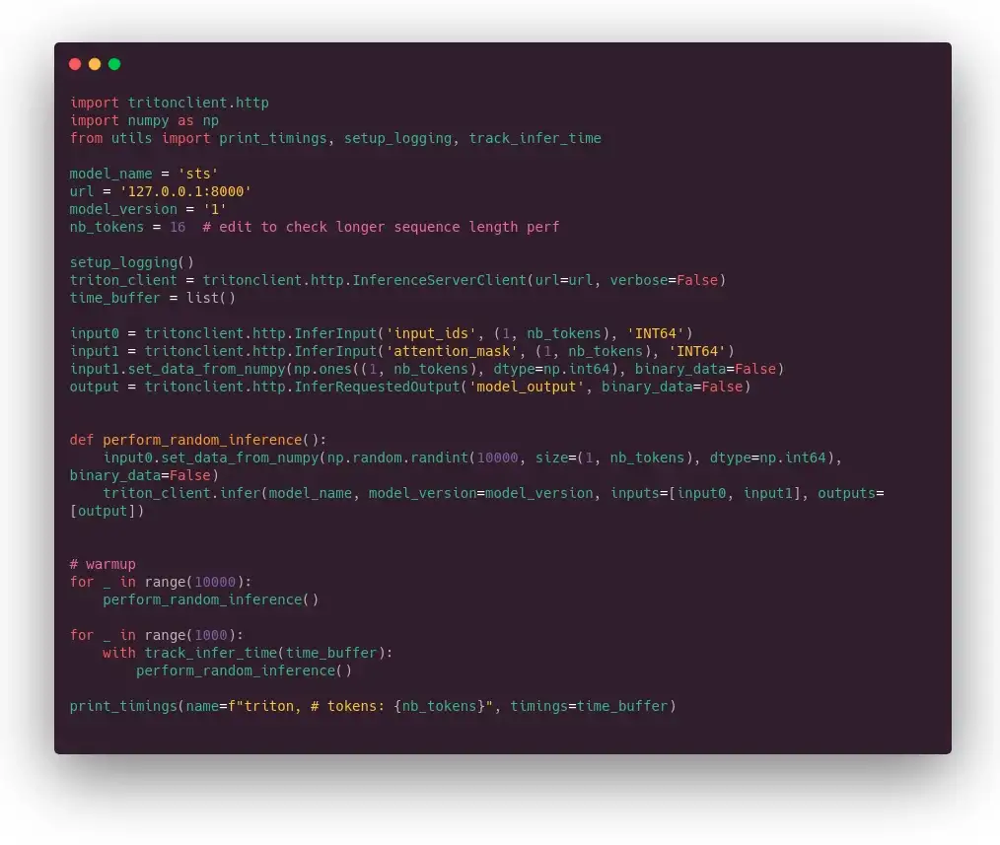{ width="100%", loading=lazy }
  <figcaption>Not the most pythonic API ever 🐍 (Image by Author)</figcaption>
</figure>

The little subtlety in the client library is that you first declare the input and output variables and then load data
into them.

> Note that input ids tensor is **randomly generated** for each request, to avoid any cache effect (as far as I know,
> there is no cache by default but always good to check).

Results for 16 (first measure) and 128 token (second measure) input length:

<figure markdown>
  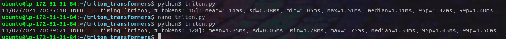{ width="100%", loading=lazy }
  <figcaption>Benchmark ONNX Runtime + Triton inference server (Image by Author)</figcaption>
</figure>

Awesome, we are onto something: for both 16 and 128 tokens sequence length we are under still the Hugging Face baseline.
The margin is quite significant in 128 token case.

We are still doing pure model computations on the GPU, to have something we can compare to Hugging Face Infinity we
still need to move the tokenization part to the server.

### 3/ Adding the tokenization on the server side

**Did I tell you that the Nvidia Triton server is awesome?** It is. It supports several backends including one called
“Python”. In the Python backend we can call free Python code, for instance to prepare our data (tokenization in our
case).

> _Before implementing this part, you need to install transformers in the Triton Docker container. Check the README of
the repository associated to this article for more information._

What the Python code looks like:

<figure markdown>
  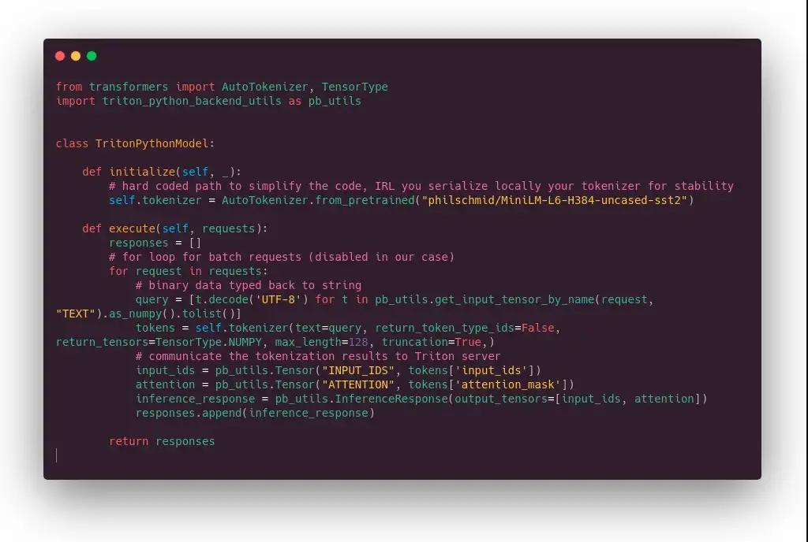{ width="100%", loading=lazy }
  <figcaption>Quite straightforward Python code (Image by Author)</figcaption>
</figure>

Basically, there is a kind of `__init__()` function where we download the tokenizer, and an `execute` function to
perform the
tokenization itself. The for loop is because of the dynamic batching function. Very short and simple code.

We need a configuration to tell Triton what to expect as input and output.

<figure markdown>
  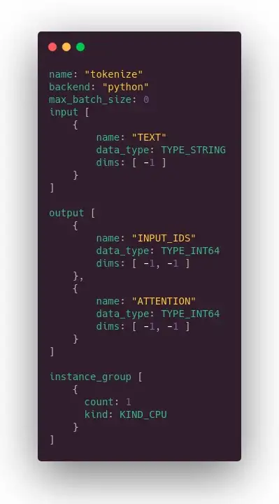{ width="100%", loading=lazy }
  <figcaption>Similar to the previous configuration (Image by Author)</figcaption>
</figure>

Now we want to plug the tokenizer to the model, we need a 3rd configuration.

<figure markdown>
  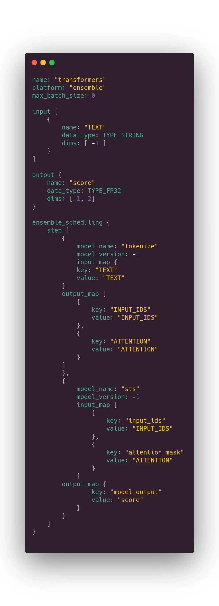{ width="100%", loading=lazy }
  <figcaption>Configuration file to plug the tokenizer output to the model input (Image by Author)</figcaption>
</figure>

First part declare the input and the output of the whole process, the second one plug everything together. Basically, it
says receive a string, send it to the tokenizer, get the output from the tokenizer and pass it as input of the model,
return the model output.

As said before, the server documentation is well written. It’s easy to use the wrong type, the wrong dimension, or
insert a typo in tensor name, Triton error messages will tell you exactly what to fix and where.

### 4/ 👀 final benchmarks!

Finally, here is the time of the final benchmark. Below you can see our final client script. The main difference with
the previous client script is that we are now targeting the full process and not just the model. We don’t send integer
tensors but just the string (stored in a numpy array which is the way to communicate with Triton).

<figure markdown>
  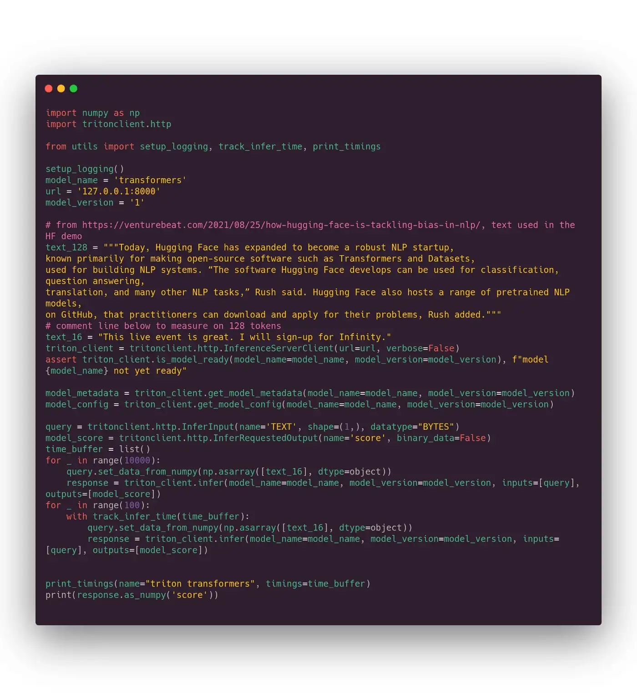{ width="100%", loading=lazy }
  <figcaption>*THE* most important benchmark script in this article. Simple, will do the job. Better tooling is provided with
tritonclient (unfortunately this tooling requires a compilation to work on Ubuntu 18.06. In 2021 don’t do like AWS, use
recent Ubuntu release!) (Image by Author)</figcaption>
</figure>

And the measures for 16 (first measure) and 128 (second measure) tokens:

<figure markdown>
  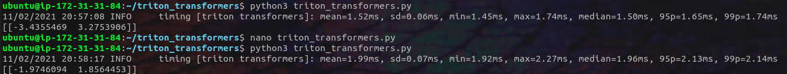{ width="100%", loading=lazy }
  <figcaption>The final result, target reached! (Image by Author)</figcaption>
</figure>

> _🎯 We made it! **1.5ms** for 16 tokens (vs 1.7 ms on Hugging Face Infinity) and 2ms for 128 tokens length (vs 2.5 ms
on Hugging Face Infinity)._

We have built a fast inference server ready to be deployed in our clusters. We will now enjoy how GPU monitoring makes
auto scaling easier to set up, or how mature performance measure tooling will help us to fix bottlenecks in our
pipelines. **And this is absolutely awesome for machine learning practitioners, startups and enterprises**.

So now, what can we expect from the future?

## Outro

Unlike what you will read in some media, many think that the machine learning community is still in its infancy. In
particular, there is a topic coming again and again that most of the machine-learning projects have never been deployed
in production, it would be just marketing content and posts from machine learning enthusiasts, like
in [Why 90 percent of all machine learning models never make it into production](https://towardsdatascience.com/why-90-percent-of-all-machine-learning-models-never-make-it-into-production-ce7e250d5a4a#:~:text=The%20data%20speaks%20for,something%20useful%20for%20the%20company)
or [Why do 87% of data science projects never make it into production?](https://venturebeat.com/2019/07/19/why-do-87-of-data-science-projects-never-make-it-into-production/)
or [Why ML Models Rarely Reaches Production and What You Can Do About it](https://www.wallaroo.ai/blog-posts/production-ml),
etc.

> _Obviously, someone used GPT-9 to generate these contents. If you know where to download the weights of GPT-9, please
drop me a PM :-)_

I doubt anyone can really measure it, but for sure there are too few serious articles on NLP model deployment. I hope
you enjoyed that one and my hope is that, if you have the time for it, maybe you can share your optimization/deployment
experience with the community on Medium or elsewhere. There are so many other important things to fix in NLP, CPU/GPU
deployment should not be a challenge in 2021.

As a community, we also need appropriate communication from key players, even when it comes to selling products to
enterprises. For instance, messages like _“it takes 2 months x 3 highly-skilled ML engineers to deploy and accelerate
BERT models under 20ms latency”_ miss key technical details (model, input size, hardware), making any comparison
impossible. Moreover, calling these engineers “highly skilled” and still unable to achieve their goal after months of
work implies fear, uncertainty and doubt about our own ability to do the same.

And to finish, we need more inference optimizations targeting NLP models in open source tools!

At the bi-LSTM/GRU & friends time, and during a few years, it was like there was a big architecture change every month.
Then transformer came, and ate most NLP tasks. There were still some architecture variations, and the Hugging Face
Transformers library was here to help machine learning practitioners to follow the hype without big investment in code
rewriting.

<div class="exergues">
  <h2>I have the feeling that model architectures have now stabilized and that the fear of missing the latest trendy
architecture is decreasing in the community.</h2>
</div>

To say it differently, if you already have in your toolbox a Roberta, a distilled model like miniLM, and a generative
model like T5 or Bart, you are probably ok for most industrial NLP use cases for 1 or 2 years.

It’s good news for machine learning practitioners, because this stabilization opens the door to increased efforts from
Microsoft, Intel, Nvidia and others to optimize NLP models. Big latency time reduction or highly increased throughput
will not only be translated into lower-cost inference, but also by new usage and new products. We may also hope that
someday, we can even use those very large language models (those in the hundreds of billions of parameters) that are
supposedly able to do plenty of awesome things. I am personally confident that it will happen as it’s in the interest of
hardware builders and cloud providers to develop NLP usages, and they have both resources and the knowledge to do these
things.