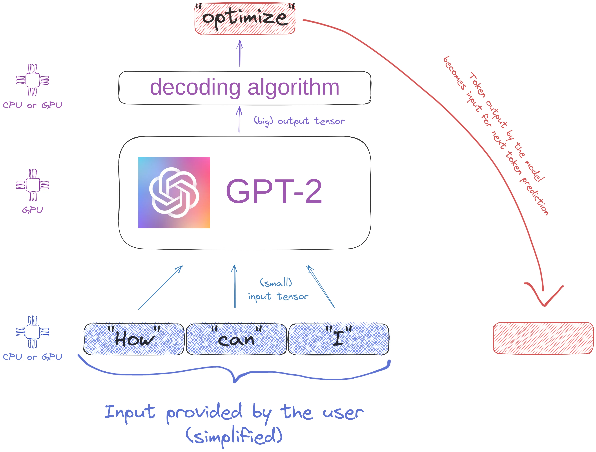
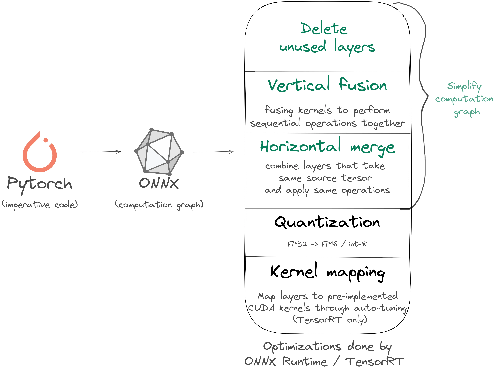

# What we learned by accelerating by 5X Hugging Face generative language models

2 trends ongoing in the NLP ecosystem: bigger language model and better text generation. 
Both are NLP game changers (zero shot, etc.) but they bring their own challenges: 
how to perform inference with them? At what cost? GPU or CPU ? etc.

<!-- more -->

That’s what we worked on recently, and below you will find the **main lessons learned** :

- memory IO is by far the main perf bottleneck
- Standard API of ONNX Runtime should not be used but there is an undocumented way of using another ONNX Runtime API which works well
- Nvidia TensorRT is always the fastest option on GPU, by a large margin
- Caching K/V token representation do not bring any inference optimization (quite unexpected)

Project: [https://github.com/ELS-RD/transformer-deploy/](https://github.com/ELS-RD/transformer-deploy/)

Notebook (reproduce measures): [https://github.com/ELS-RD/transformer-deploy/blob/main/demo/generative-model/gpt2.ipynb](https://github.com/ELS-RD/transformer-deploy/blob/main/demo/generative-model/gpt2.ipynb)

## 1/ Reminder

Generative text language models like GPT-2 produce text 1 token at a time. 
The model is auto regressive meaning that each produced token is part of the generation of the next token. 
There are mainly 2 blocks: the language model itself which outputs big tensors, 
and the decoding algorithm which consumes those tensors and selects 1 (or more) tokens.

Keep in mind that these blocks may live on different hardware… (spoiler: it’s not a good idea)

<figure markdown>
  { width="100%", loading=lazy }
</figure>

## 2/ Memory IO is the main performance bottleneck

Classic approach to make transformer inference 5-10X faster:

Pytorch -> ONNX -> computation graph simplification -> quantization -> Fast!

<figure markdown>
  { width="100%", loading=lazy }
</figure>

Sounds cool, but when we tried on GPT-2 with ONNX Runtime we got a model 60% slower than vanilla Pytorch!

## Why?

Standard ONNX Runtime API uses numpy tensors for input/output, and for this text generation this is an issue… 
To generate a single 256 tokens sequence with GPT-2 base, **GPT-2 will output 6Gb of tensors**. For beam search it’s more. 
Because numpy tensors are stored on host memory (RAM), we are moving 2X 6Gb through the PCIe bus interface and it can’t go well.

ONNX Runtime has a less known API called `bindingIO`. It takes/returns pointers to `ORTValue`. 
It’s not documented, but you can also provide pointers to Pytorch tensor storage! 
Check that these tensors are contiguous in memory or you will lose hours wondering why predictions work randomly 😭

API documentation (but not mentioning Pytorch) : [https://onnxruntime.ai/docs/api/python/api_summary.html#iobinding](https://onnxruntime.ai/docs/api/python/api_summary.html#iobinding)

There is another trick with this API, you need to allocate memory on GPU for the output tensor before starting the inference. 
Unlike TensorRT, ONNX Runtime has no mechanism to predict output tensor shape regarding a specific input.

**2 strategies**: if an output tensor axis is expected to be the same size as some input axis, just give it the same name. 
If the rule is more complex, store it as a meta inside the ONNX file (it has a field for it).

some source code to see how to do it: [https://github.com/ELS-RD/transformer-deploy/blob/main/src/transformer_deploy/backends/ort_utils.py](https://github.com/ELS-RD/transformer-deploy/blob/main/src/transformer_deploy/backends/ort_utils.py)

By taking care of memory IO, ONNX Runtime inference is 3X faster than vanilla Pytorch 😅

TensorRT will push computation graph optimization further, we get 5X faster inference than Pytorch!

## 3/ Caching K/V token representations doesn’t make generation faster on GPU

Hugging Face lib offers the possibility to cache K and V representations of each token to avoid recomputing things and make inference faster for the next token. 
Does it work?

You may check this very good thread to remind you what is it about: [https://twitter.com/MishaLaskin/status/1479246948637057027](https://twitter.com/MishaLaskin/status/1479246948637057027)

Cache management brings some overhead (concat tensors, copies, etc.). On a fast GPU, 
recomputing K/V representations on optimized graph is 2X faster than using a cache version (no optimization because it crashes on it)!

Some explanations:

- cached values represent only a part of self-attention computation,
- optimized graph transforms self-attention in a single giant matrix multiplication, an op very well optimized,
- Caching a part of the computation breaks those optimizations

## 4/ Next steps

Microsoft has published some work to reduce cache overhead on text generation. It’s definitely something we want to try: 
[https://arxiv.org/pdf/2105.04779.pdf](https://arxiv.org/pdf/2105.04779.pdf)

Also, applying GPU int-8 QAT quantization to decoder models may bring another X2 speedup on top of what we have.

In case you are interested in this kind of stuff, follow me on Twitter: [https://twitter.com/pommedeterre33](https://twitter.com/pommedeterre33)