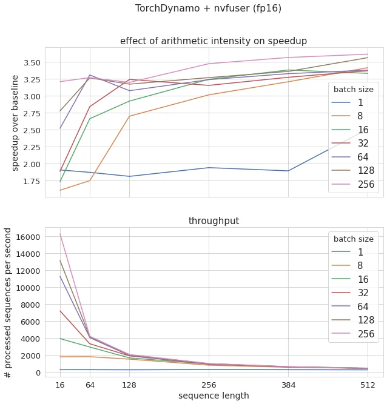

# What we learned by benchmarking TorchDynamo (PyTorch team), ONNX Runtime and TensorRT on transformers model (inference)

**TL;DR:** `TorchDynamo` (prototype from PyTorch team) plus `nvfuser` (from Nvidia) backend makes Bert (the tool is model
agnostic) inference on PyTorch > **3X** faster most of the time (it depends on input shape) by just adding a single line of code in
Python script.
The surprising thing is that during the benchmark, **we have not seen any drawback implied by the use of this library**, the acceleration just comes for free.
On the same model, TensorRT is (of course) much faster, > **5X** at least (and even more at batch size 1 which is
impressive) but comes with its own complexity.
The tool being a prototype, better performances are to be expected with more mature support of some backends, in
particular regarding fx2trt (aka TensorRT mixed with PyTorch)!

<!-- more -->

Our TorchDynamo benchmark notebook can be found there:
[https://github.com/ELS-RD/transformer-deploy/blob/main/demo/torchdynamo/benchmark.ipynb](https://github.com/ELS-RD/transformer-deploy/blob/main/demo/torchdynamo/benchmark.ipynb)

TorchDynamo results for different batch sizes / seq lengths are summarized in the graph below (baseline being PyTorch
FP32, FP16 here is full FP16, not mixed precision as it is not yet supported, FP32 results available in the notebook):

<figure markdown>
  { width="100%", loading=lazy }
  <figcaption>nvfuser backend + FP16 results</figcaption>
</figure>

## 1/ GPU model execution optimization 101

To make it short, GPUs are fast at computing things and the main performance bottleneck is memory access.
If you program in CUDA, most of your effort is spent on how to limit memory access by reusing data loaded in cache as
much as possible (aka improving memory locality).

For that purpose, there is a transformation called (vertical) kernel fusion which basically is replacing a series of
operations with usually similar memory access patterns by a single one doing the same work.

For instance, if you chain 2 matrix additions on PyTorch, because of the eager execution between the 2 you save output
of the first one to reload it just after to feed the second one.
Kernel fusion is basically load data once, do your 2 additions in register, and then save output to GPU RAM. ORT and TRT
do that automatically.
They also have more complex kernels manually tweaked to replace long series of operations like attention pattern (you
may check this recent paper which made some noise recently: [https://arxiv.org/abs/2205.14135](https://arxiv.org/abs/2205.14135)).

!!! note

    Note that most of us uses daily PyTorch fused kernels through high level layers like `softmax` or `linear` modules. 
    If they were implemented traditionally (as a serie of exp, sum, matmul, addition, etc.), models would be much slower to train and infer.

For matmul, the optimal way the computation is parallelized among the thousands of streaming processors that GPUs have
requires manual tweaking (tile sizes, etc.) as performances depends on many parameters, mainly matrix shape and its dtype, the possibility to leverage tensor
cores (which have their own constraints), etc.
That’s why the most performant kernels are built in a monolithic way for a specific model. Some tools are trying to do
that automatically, but got mitigated results for Nvidia GPUs.

There are other classes of inference optimizations, and all have the same purpose: use your GPU in a way which
approaches its peak performance.

## 2/ The context

By building (and using in production)
transformer-deploy ([https://github.com/ELS-RD/transformer-deploy/](https://github.com/ELS-RD/transformer-deploy/)),
a library to deploy transformer models on ONNX Runtime / TensorRT + Triton server, we have gained first-hand experience
in big NLP model compilation and deployment on GPU mainly.
What strikes us again and again is that those 2 ML compilers may sometimes seem inappropriate to modern NLP (with
dynamic shapes and behaviors).

By design, you go through some graph computation export (often ONNX export) which makes everything static and ease
automatic inference optimization.
You have the choice between tracing and losing every dynamic behavior or scripting and lowering your code quality
(check [https://ppwwyyxx.com/blog/2022/TorchScript-Tracing-vs-Scripting/](https://ppwwyyxx.com/blog/2022/TorchScript-Tracing-vs-Scripting/) 
for more about this topic).
If you use the Hugging Face library, you go through tracing, and then, for instance, seq2seq models (GPT-2, T5, etc.)
can’t use KV cache because for that you need some dynamic behavior (_if_ [is first generated token] _then cache else_ reuse
cache)… and the model is super slow because it does and redoes some computations it could have cached.
We have written on how to avoid this for T5 [here](../what-we-learned-by-making-t5-large/index.md).
Recently, a similar feature has been added to ONNX Runtime for T5 (but it has its own limitations out of the scope of
this post).

Moreover, if you don’t code in CUDA (as most ML practitioners), you are dependent on which models your preferred backend
has optimized.
For instance, right now, ONNX Runtime and TensorRT don’t offer advanced kernel fusion for T5 attention with cache
support, and T5 is not what you would call a new or uncommon model.
It should come at least in the coming months in TensorRT.

## 3/ TorchDynamo as a solution

TorchDynamo is a tool from the PyTorch team to make inference and/or training much faster without having to modify any
code.
Under the hood it’s a JIT compiler for PyTorch. The original part is that it doesn’t try to optimize your whole model
by imposing some constraints in the way you write it (like torchscript) or forcing you to export it to some static
representation,
instead it searches small parts of your code which are optimizable and ask a backend to accelerate it.
If it doesn’t support some part of your code, it just keeps it like it is,
basically it won’t crash if you have some Cumpy / Numpy calls in the middle of your PyTorch model (still why would one
do such a thing?)

The second point is that it supports many backends, which, of course, includes the 2 PyTorch fusers like nnc and
nvfuser (the ones you may use with torchscript).
We focused on them as they are the easiest to use (there is nothing to do) and are in line with the spirit of the tool 
(at least our understanding of its spirit): easy and model agnostic.

## 4/ Results

Check the
notebook [https://github.com/ELS-RD/transformer-deploy/blob/main/demo/torchdynamo/benchmark.ipynb](https://github.com/ELS-RD/transformer-deploy/blob/main/demo/torchdynamo/benchmark.ipynb)
for detailed results, but what we will keep in mind:

- Out of the box results are comparable to ONNX Runtime when Bert specific kernels are not used ;
- The simplicity of use of TorchDynamo is impressive: add a context manager, and poof, enjoy ;
- Compilation times implied by Nvfuser are barely noticeable ;
- Nvfuser is competitive with nnc even if it’s much newer ;
- TensorRT Bert model is super well optimized, bravo Nvidia people 👏 We used Bert for the tests as it’s probably the
  most optimized transformer model out there and shows.
- Curious of the performance of fx2trt when it will support dynamic shapes, we wouldn’t be surprised to get X2/X3
  performances.