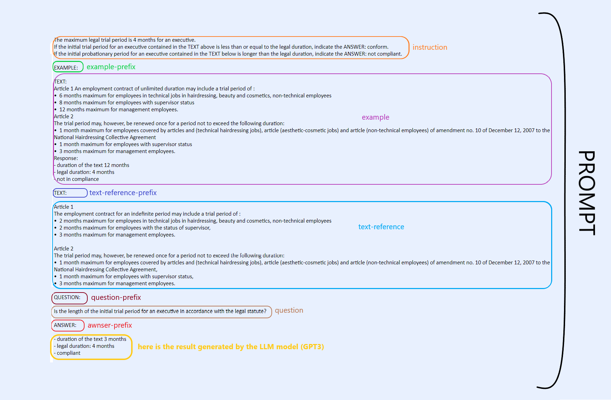

[//]: # ([LLM quality checker]&#40;https://github.com/ELS-RD/llm-quality-checker&#41;)

# Are LLM relevant for legal topics?

We are pleased to present the LLM quality checker, an open-source project, which aims at sharing a methodology and a
first multilingual dataset in French, Spanish and Italian to test the quality of large language models (LLM) on legal
content.

<!-- more -->

**Link to the GitHub project
**: [https://github.com/ELS-RD/llm-quality-checker](https://github.com/ELS-RD/llm-quality-checker)

For a few months, the new AI models have been tested in several domains with very impressive results, for natural
language processing ([ChatGPT](https://openai.com/blog/chatgpt) (GPT3)
or [BLOOM](https://huggingface.co/bigscience/bloom)) and image
generation ([DALL-E](https://openai.com/product/dall-e-2)).

In the Legal field, it is still difficult to get a clear picture of the added value of large language models (LLM).
Indeed, GPT can [pass the bar exams](https://arxiv.org/abs/2212.14402), but we’re
still [doubtful about the quality](https://papers.ssrn.com/sol3/papers.cfm?abstract_id=4335905).

At [Lefebvre Sarrut](https://www.lefebvre-sarrut.eu/en/), European leader in legal and tax publishing, we think that a
good methodology to figure out the possibility of a LLM usage in Legal domain is to precisely measure their abilities on
some series of legal tasks. So, this is what the [Lefebvre Sarrut R&D team](https://github.com/ELS-RD) is working on
currently.

The goals of the [LLM quality checker](https://github.com/ELS-RD/llm-quality-checker) project are the following:

- build a collection of tasks that can test various aspects of legal reasoning with LLM,
- understand how different patterns perform on these legal tasks and which recipe types improve performance (e.g.,
  prompt types),
- open the field for the development of new legal tools with these new advanced technologies.

Because we believe in collaboration and open source, we decided to start building a benchmark to answer this question
and share a **[dataset of some tasks and prompts on legal content](https://github.com/ELS-RD/llm-quality-checker)**. Our
work is directly inspired by the [LegalBench Standford project](https://github.com/HazyResearch/legalbench). We also
learned and got inspiration from [David Shapiro’s videos](https://www.youtube.com/@DavidShapiroAutomator/about).

**We encourage the whole community to try this methodology, this first dataset and enrich it with some use cases and
data, in any language. Above all, we’ll be very happy to receive your feedback.**

In this article, we explain how we built this dataset and what we have learned from this experimentation. We started
with some tasks on Collectives Agreements in Spanish, French and Italian, and tried to solve French practical legal use
cases. We present our results with GPT3.

## Methodology

We needed to find a way to test different LLMs with as little effort as possible. We decided to use a Google sheet
[Template llm quality checker](https://docs.google.com/spreadsheets/d/17I_sZpeHKOmhdQY57egtZ5-iYFkMWRk96Mcae9MhyfE/edit#gid=1390642715)
to call the API of each LLM we tested and stored the results and our evaluation in it.
We’ll find detailed information on the use of it in
the [readme file](https://github.com/ELS-RD/llm-quality-checker#readme).

## Experimentations

### 1. Can llm be useful on collective agreements?

#### The choice of collective agreements

As a European actor, it was important for us to deal with legal content in several European languages. Also, collective
agreements are written in diverse ways depending on the sector or activity and it was interesting to test the same
prompt for the same task but running on quite different paragraphs depending on the collective agreement.

**The art of prompt** - The main challenge was to structure the way we had to send our prompt to the APIs of the models.
For
some models like GPT3, the structure improved the result. For others like Bloom (at least with the last version we
tested), it was mandatory to hope for reliable results. We needed to sequence our prompts to be more efficient. After
some testing, we decided on the following structure:

<figure markdown>
  { width="100%", loading=lazy }
</figure>

- The first element is instruction. This only element is mandatory. It must be on the first line. It describes the task
  to be performed by the LLM
- Then some examples can be provided to help the LLM to generate the best answer,
- Also, a text to analyze can be written,
- Depending on the task, a question can be added,
- At the end, an introducer to the answer might be set up.

The structure of the prompt helped us a lot to start but it was not enough to have good results.

In fact, inventing and refining a prompt is a [creative and iterative process](https://arxiv.org/pdf/2212.01326.pdf).
Sometimes, to answer the question, you need to extract and order the data first and then the LLM will provide the right
answer. It is the case for instance when you want to know if the trial period from a specific collective agreement is
compliant with a general rule. Without the example with a text and an actual answer, the result was quite bad.

<figure markdown>
  { width="100%", loading=lazy }
  <figcaption>Example of a prompt</figcaption>
</figure>

We tested different models for these tasks. GPT3 only was able to provide us with relevant and consistent results.

#### Test results with GPT3

You will find below the success rate reached by GPT3 working on **data extraction** and **legal reasoning** on
Collective agreements. For each task, we gave GPT3 three trials to find the right result and we averaged the results
task by task.

We regrouped the results depending on the kind of task and its complexity.

We figured that GPT3 gives almost perfect results for extracting a single datum like a number or a few words in similar
paragraphs (eg: reference number of the collective agreements or the numbers of days off for a category of employees).
And the best part of it is that just one single example has been used in the prompt to get such great results!

Then we tried to extract multiple data and the score went down to 85 % of success (eg: identifying a fault or a sanction
to an employee or extracting the amount of salary that an employee will receive for working at night).

We tested some **legal reasoning** based on **a legal rule and a text of a collective agreement**. For instance, we
tried to answer the following question: _is an employee who has been with the company for 14 months entitled to
severance pay?_ The results are globally good (average of 79 %) but with some big mistakes sometimes.

| LEGAL DATA EXTRACTION | French | Italian | Spanish | Global | 
|:----------------------|:-------|:--------|:--------|:-------|
| Single datum          | 100%   | 95%     | 97%     | 97%    |
| Multiple data         | 73%    | 93%     | 89%     | 85%    |

| LEGAL REASONNING     | French | Italian | Spanish | Global |
|:---------------------|:-------|:--------|:--------|:-------|
| Comparison of values | 75%    | -       | 83%     | 79%    |

### 2. Can llm solve a pratical legal use case?

#### The choice of practical legal use case

The idea was to test if a **LLM** can “act” like a law student and be able to solve a legal problem, based on the same
exercises' students practice with.

This kind of exercise is difficult because you need to identify the relevant facts, find the legal issue, provide the
rule and find the solution. In our tests, we decided to limit the experimentation to the first steps of the methodology:
summarization of the facts and finding the legal issue.

To go further, it would require us to provide the right laws and rules, and then to ask the model to apply it to the
situation. In our case, it was not possible to proceed this way because of the token (characters) limitations of the
**LLM**.
[Here is an example](https://actu.dalloz-etudiant.fr/le-cas-du-mois/article/depression-amoureuse/h/1ee2b4812fd993573d09124ae76a7379.html)
of a full practical legal use case with his solution.

#### Methodology to solve a practical legal use case

A methodology to solve a legal use case like a student is available
on [Dalloz étudiants](https://fiches.dalloz-etudiant.fr/methodologie/fiches-de-methodologie/detail/fiche/194/h/aad2aa1359541d9c51b9363d4afcd3db.html).
The practical legal use case tests the student's ability to reason legally. This exercise takes the form of a short
story that pits several parties against each other and leads to a dispute that must be resolved. The practical case is a
delicate exercise because it requires: first, to understand the legal problem raised by the factual situation; then,
discover the abstract solution; finally, apply this solution to the case in question.

The preparatory work begins with the presentation of the legal issue. These are the tasks we are going to ask our
**LLM** to do so.

The approach to successfully overcoming this initial difficulty consists in selecting from among the case's facts those
of interest and qualifying them. Once this selection and qualification work is over, it is necessary to identify the
legal question(s) raised by the specific case and set them out clearly and precisely.

To do so, we decided to try two different tasks with different modalities, first to summarize the facts and then to find
the legal issue.

#### Summarization of the facts

The first difficulty when summarizing the facts is that the practical legal use case is usually written as an Agatha
Christie’s novel with a lot of details, and you must find the most important legal elements in them and exclude
everything not useful. We tried several ways to write the prompts to see how to “explain” the methodology to the LLM (
you will find the two most promising prompts in the
project [dataset](https://github.com/ELS-RD/llm-quality-checker/tree/main/tasks/fr/practical-cases)). We tested the
prompts with GPT3 and the results were sometimes good, sometimes bad.

- For the **first approach** at summarization, the following instruction was written in the prompt.

<figure markdown>
  { width="100%", loading=lazy }
</figure>

- For the **second approach**, the prompt was simplified. We removed the example, and wrote the following instructions:

<figure markdown>
  { width="100%", loading=lazy }
</figure>

#### Finding the legal issue

We’ve tested three approaches to test the ability of LLM to find the legal issue for a practical legal use case, either
with a lot a detailed text or with limited and more accurate text in entry.

- We give the facts, the summarization and the legal qualification of the facts provided in the solution of the
  practical
  legal use case, and one example.

<figure markdown>
  { width="100%", loading=lazy }
</figure>

- We give the summarization and the qualification of the facts, and one example.

<figure markdown>
  { width="100%", loading=lazy }
</figure>

- We just give the facts, and one example.

<figure markdown>
  { width="100%", loading=lazy }
</figure>

The instruction is the same for these three approaches: _“Identify the legal question asked by the facts and present it
with clarity and precision.”_

### Results of the tests with GPT3

In our tests, we decided to limit the experimentation to the first steps of the methodology: summarization of the facts
and finding the legal issue. We tested only in French and for each task, we gave GPT3 three trials to find the right
result and we averaged the results task by task.

- **Summarization of the facts** - The main issue we faced was that the prompt was very long and that sometimes GPT3
  hallucinated or provided the summarization of the example instead of summarizing the right text. When we reduced the
  number of characters this problem was solved, but the summarization was less accurate.

  For sure, in the different approaches we tested, some facts were missing, some elements were irrelevant but globally
  it seems to be quite the same quality as a first-year student of average level.

- **Finding the legal issue** - We tested three approaches to test the ability of LLM to find the legal issue for a
  practical legal use case, either with a lot a detailed text or with limited and more accurate text in entry.

  The results we got with GPT3 were not so good: only 45% of the results were relevant. For sure, the prompt can be
  improved, and we might expect better results for this kind of task. We’ll probably work on it in the coming weeks.

| LEGAL REASONNING           | French | 
|:---------------------------|:-------|
| Summarization of the facts | 55%    |
| Finding the legal issue    | 45%    |

## And now?

Do you find any interest in the subject and our approach? Please let us know and join
the ["LLM quality checker" project!](https://github.com/ELS-RD/llm-quality-checker)
The information and the dataset are available on [GitHub](https://github.com/ELS-RD/llm-quality-checker). If you have
any questions or comments, do not hesitate to contact our team at
<a href="mailto:rd-feedback@lefebvre-sarrut.eu">rd-feedback@lefebvre-sarrut.eu</a>.

Our road map includes the following elements (in no particular order):

- Complete the dataset with more collective agreements in French, Spanish, Italian but also German, Dutch or other
  European languages;
- Continue to work on prompting to have better results on practical legal use case;
- Find new use cases on legal reasoning based on legal rules.