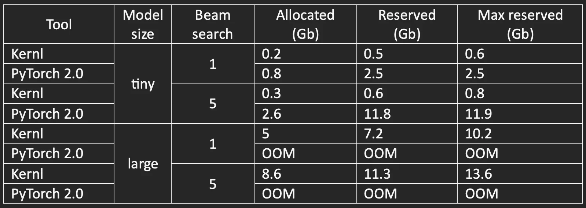

# Get 2x Faster Transcriptions with OpenAI Whisper Large on Kernl

We are happy to announce the support of OpenAI Whisper model (ASR task) on Kernl.

We focused on high quality transcription in a latency sensitive scenario, meaning:

- _whisper-large-v2 weights_
- _beam search 5 (as recommended in the related paper)_

We measured a 2.3x speedup on Nvidia A100 GPU (2.4x on 3090 RTX) compared to Hugging Face implementation using FP16
mixed precision on transcribing librispeech test set (over 2600 examples). For now, OpenAI implementation is [not yet
PyTorch 2.0 compliant](https://github.com/openai/whisper/pull/115).

<!-- more -->

In the post below, we discuss what worked (CUDA Graph), our tricks (to significantly reduce memory footprint), and what
did not pay off (Flash attention and some other custom Triton kernels).

- **Kernl repository**: [https://github.com/ELS-RD/kernl](https://github.com/ELS-RD/kernl)
- **Reproduction script
  **: [https://github.com/ELS-RD/kernl/blob/main/experimental/whisper/speedup.ipynb](https://github.com/ELS-RD/kernl/blob/main/experimental/whisper/speedup.ipynb)

## Unsung hero: CUDA graphs

CUDA graphs technology provides most of the speed up. Compared to vanilla PyTorch 2.0 (“reduce-overhead mode”), we
provide a limited memory footprint when vanilla PyTorch 2.0 may raise OOM exception.

<figure markdown>
  { width="100%", loading=lazy }
  <figcaption>Memory footprint</figcaption>
</figure>

Experiments have been run on a 3090 RTX with 24 Gb DDR. A reminder that PyTorch 2.0 focuses on training, not inference,
which may explain why it OOMs rapidly in this case.

At its beginning, many partitioners were surprised by PyTorch eager mode performances, when compared to TensorFlow 1.x
compiled models: they were on par! Python brought its flexibility and ease of debugging without implying any significant
performance cost.

This is mostly because GPUs are latency hiding hardware: when PyTorch launches an operation on GPU, it sends
instructions from host (CPU) to a queue (the CUDA stream), which allows PyTorch to continue Python script execution
without having to wait for CUDA kernel to finish its work. This strategy effectively hides most of the Python overhead,
in particular when there are some computation costly operations like convolutions or matrix multiplications.

Each new generation of GPUs being much faster than its predecessor, this strategy could not last forever, according to
one PyTorch maintainer, it is an “existential
problem” ([dev podcast](https://pytorch-dev-podcast.simplecast.com/episodes/pytorch-20), around 8mn30).

In inference mode, especially in latency-sensitive scenarios where batch size tends to be low, there is often little
computation to perform (regarding what modern GPUs can do), making it even harder to hide effectively Python overhead.
It’s accentuated in the case of generative models like Whisper, because each decoder call focuses on generating a single
token, and a part of the computation is cached for the next token.

This is a typical situation where CUDA graph is very helpful.

The main idea behind CUDA graph is that we can replace a series of instructions sent from host (CPU) to device (GPU) by
one call referring to a graph of instruction stored in GPU. Check also this
twitter [thread](https://twitter.com/cHHillee/status/1616906059368763392) for more explanations.

First it will observe the inference of a model for specific input shapes and then replay it without going through most
of the Python code.

One constraint is that it will replay the exact same operations with the exact same arguments.

For instance, memory addresses used by kernels are captured and therefore need to be static. For input tensors, it means
that for each inference, we need to allocate some GPU memory and copy them there before the capture and copy all the
following input tensors at the very same place.

The second constraint is that dynamic shapes are not supported by CUDA graph because it captures everything. We could
have our own machinery in front of the model, but PyTorch 2.0 offers the right tooling to manage that point out of the
box.

Basically, dynamo offers a mechanism which checks if the model has already been captured for specific input shapes and
some other states and capture it if not yet the case. You just have to provide a function which converts to CUDA graphs
and you are done.

Out of the box, PyTorch 2.0 provides a “reduce-overhead” mode which applies CUDA graph to the model. Unfortunately, for
now, it will raise an OOM with Whisper large or medium because it reserves some CUDA space for each input shape.
Therefore, for a generative model it rapidly fulfills the GPU memory, in particular because of the K/V cache which can
be huge.

We have worked around this constrain by building our own layer on top of the memory pool of PyTorch.

Basically, a PyTorch tensor is made of 2 parts, a CUDA allocated memory represented by PyTorch as a “storage”, and a
bunch of metadata associated with it. Among the metadata there is a CUDA memory address, the tensor shape plus its
strides, its dtype and... a memory offset.

Our idea is to create a very large tensor and share its storage between several input tensors, using offset metadata.
With this solution, we avoid specializing in input tensor shapes and share the reserved memory for different input
shapes related to several CUDA graphs.

As shown in the table above, it significantly reduces the memory overhead.

## What about custom (Triton) kernels for attention?

**TL; DR: we tried, they work, we got up to 2 times faster than eager PyTorch for cross attention and they bring close
to
nothing in e2e latency mostly because the improvement is not big enough to matter 🙁**

Below, we follow the convention of naming Q, K and V, the 3 tensors used in the attention of transformer models.

Whisper is based on a classic transformer architecture, with an encoder and a decoder.

Two characteristics of this model are of interest:

- The shape of Q tensor used in cross-attention is always [batch, #heads, 1, 1500].
- Model has been trained on 30-second audio files and their associated transcript. Because audio files are short, the
  sequence to generate is usually short, fewer than 50 tokens most of the time.

Because of these characteristics, optimizing attention has a low reward. In particular, the now common trick “replace
attention with flash attention” is counterproductive:

- self-attention: sequences are very short, so quadratic complexity is less of an issue;
- cross-attention: using flash-attention leads to a 2 times slower inference on this part of the model.

We have tried to work on the second point and thought we could make cross attention faster.

Usual attention implementation (self and cross) relies on a series of operations: matmul (Q x K^t) -> rescale ->
SoftMax -> matmul (SoftMax output x V). Intermediate output tensors have a shape which usually scales quadratically with
input sequence length. They will be saved and reloaded from DDR, and memory bandwidth is a very scarce resource in GPUs.

To optimize speed, flash attention fuses operations, so basically first matmul will work on a small part of Q and K, and
directly apply SoftMax to it without saving intermediate results to DDR. Same for second matmul. Because we don't go and
back through GPU main memory, flash attention usually runs much faster than naïve implementation of attention.

The parallelization of the jobs is done on different
axes: [batch and attention head for the original flash attention](https://github.com/HazyResearch/flash-attention/issues/40),
and Triton author added a third one, tokens, aka third dimension of Q (this important trick is now also part of flash
attention CUDA implementation).

In the Whisper latency sensitive case, this doesn’t work well. The size of batches is low and sequence length (third
dimension of Q tensor) is... 1! So, even if each job is done very efficiently, our GPU occupancy is low, and basically
most of its streaming processors are idle. At the end of the day, the FA kernel is up to 2 times slower than eager
PyTorch implementation (depending on batch size and model size).

## Try 1: the very simple kernel

We noted that there is little computation to do and that we were memory bandwidth bounded. It means that most of the
time we wait for data to be transferred from main memory to shared memory.

We leveraged that fact in a very simple kernel with 2 optimizations:

- after having finishing the rescale of the QK^t matmul, we perform the SoftMax computation in parallel of loading V
  tensor for the final matmul. The SoftMax computation finishes before the end of the V loading, so basically it costs
  us nothing;
- to achieve best performances, we also changed the memory layout of V tensor in a way where we get a coalesced access,
  so we lowered the pressure on the memory bandwidth and increased instruction throughput (coalesced access let you load
  up to 128 bytes in a single instruction so you need less of them, which lets you perform more other things)

Altogether this cross attention was up to 2x faster compared to eager. It appeared to bring between 5 to 20% in
end-to-end benchmark depending on model size and batch size. Cool but far from being a game changer, it requires a
modification specific to Whisper model (memory layout of V) which is not in the spirit of the Kernl library. We decided
to search for another way of doing things (we kept the code in the library for possible future use case).

## Try 2: Skinny Flash Attention

Our second try is based on the very same trick as Flash Attention (parallel SoftMax) but is designed for tall and skinny
tensors, which is inspired by split-k strategy in GEMM (a close cousin of the matmul). The main idea is to add a new
parallelization axis over the 3rd dimension of K tensor. The next steps are in the same spirit as flash attention with a
difference that we need a new reduction operation between the different jobs' outputs. It provides 5-10% speedup
compared to eager implementation on this setup at kernel level. We kept that kernel to ease the next feature we are
working on (quantization) but the effect in end-to-end latency is inferior to 5% (still it exists 😅).

Some thoughts about PyTorch 2.0, Triton and making things much faster

Playing with PyTorch 1.14 2.0 since this summer made us quite convinced that the major update to be released very soon
will be a game changer for the ML field.

For inference (but also for training), the parallel with PyTorch vs TensorFlow is obvious to our eyes.

The traditional way to deploy a model is to export it to Onnx, then to TensorRT plan format. Each step requires its own
tooling, its own mental model, and may raise some issues. The most annoying thing is that you need Microsoft or Nvidia
support to get the best performances, and sometimes model support takes time. For instance, T5, a model released in
2019, is not yet correctly supported on TensorRT, in particular K/V cache is missing ([soon it will be according to
TensorRT maintainers](https://github.com/NVIDIA/TensorRT/issues/1845), but I wrote the very same thing almost 1 year ago
and then 4 months ago so… I don’t know).

PyTorch 2.0 makes the graph capture step easy, it has been designed to work even if not everything is PyTorch compliant.
With its Python first philosophy, it provides flexibility and debuggability.

Several years ago, some said that by design PyTorch can’t be as performant than Tensorflow because of its eager
execution model, compilation has to be faster. The same thing could be said for OnnxRuntime or TensorRT, they are C++
stuff, they have less overhead, etc. But at the end of the day, it's always the “ease of use” which is decisive. Ease of
use because of Python, but also because of the transparency in the process, Triton makes understanding and debugging
kernels much easier than closed source TensorRT Myelin engine calling closed source cuBlas library.

And of course, like TensorFlow, there will be many use cases where dedicated tools will be best choices, starting with
situations where you can’t deploy a Python interpreter.

The second lesson, Triton is easier to start with than CUDA, but you probably can’t write or debug highly performant
code without being able to, at least, read and debug PTX/SASS instructions. We realized that when we had some
performance issues... The good news is that PTX is understandable, and you will probably spot unexpected generated code
with some effort if there is any. Moreover, CUDA probably requires the same care when you really focus on performances.

We had plenty of issues with Triton, for example, cosmetics change in code may raise segfault. At some point you finish
by having an intuition of what kinds of patterns to follow to make things work, in particular when there are for loops
and dot operations. A new version of Triton has recently been released after a full rewrite of its backend, our little
tests showed some improvement on stability but we have not yet fully switched.

As in my previous post, I highly recommend that readers start playing with Triton library, I rewrite it here: it’s fun 
(at least when it doesn’t segfault) and helps you to make sense of a large part of what is happening in ML engineering. I
am quite convinced many flash attention like kernels are still to be written.

## Caveat

Two important things to note about the project described here:

- CUDA graphs require us to capture a graph per input tensor shape, there is a non-negligible warmup time. We measure
  around 10mn on 2 different machines / GPUs (down from 50mn in our previous Kernl version). One user reported with the
  new version a bit more than 20mn of warmup time. We are aware of obvious ways to decrease it significantly.
- The context here is latency sensitive optimization. In throughput sensitive one, just increasing batch size will bring
  you most of the speedup. Otherwise, more aggressive optimizations like quantization are required (not yet released on
  Kernl).