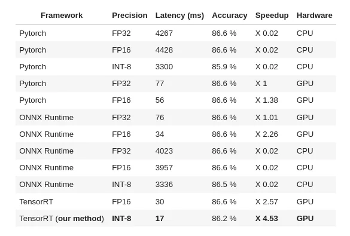
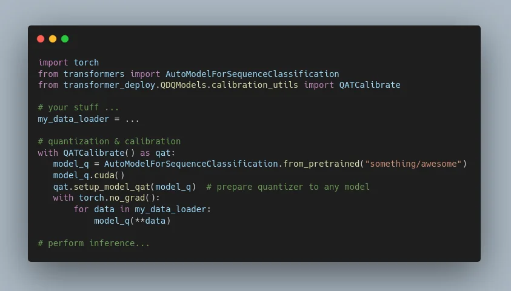

# 4.5 times faster Hugging Face transformer inference by modifying some Python AST

Recently, 🤗 Hugging Face people have released a commercial product called Infinity to perform inference with very high
performance (aka very fast compared to Pytorch + FastAPI deployment). Unfortunately it’s a paid product costing 20K for
one model deployed on a single machine (no info on price scaling publicly available) according to their product
director.

<!-- more -->

**[Transformer-deploy](https://github.com/ELS-RD/transformer-deploy)** is an open source alternative build over
enterprise-grade softwares:

- Inference server: Nvidia Triton (it takes queries and passes them to an engine, plus adds features useful for
  inference like dynamic batching, or multi inference engine dispatching)
- Inference engines: Microsoft ONNX Runtime (for CPU and GPU inference) and Nvidia TensorRT (GPU only)

It appears that without much effort, 
**[it was easy to match the very few HF Infinity public benchmarks](https://towardsdatascience.com/hugging-face-transformer-inference-under-1-millisecond-latency-e1be0057a51c?source=friends_link&sk=cd880e05c501c7880f2b9454830b8915)**.

But there was still an opportunity to push inference performances further that, AFAIK, is not yet leveraged by any other
OSS project: GPU quantization for all Transformer models!

Please find below our measures on Roberta-base, seq len 256, batch 32, MNLI dataset (classification):

<figure markdown>
  { width="100%", loading=lazy }
</figure>

Source
code: [https://github.com/ELS-RD/transformer-deploy/blob/main/demo/quantization/quantization_end_to_end.ipynb](https://github.com/ELS-RD/transformer-deploy/blob/main/demo/quantization/quantization_end_to_end.ipynb)

repo: [https://github.com/ELS-RD/transformer-deploy](https://github.com/ELS-RD/transformer-deploy)

Performing GPU quantization requires modifying model source code (to add some specific nodes called QDQ on costly
operations like matrix multiplication), which is both error prone, boring and a good generator of technical debts (you
maintain yourself the source code of your modified model). We have done that work manually for several models, and it
appeared to us that it can be made automatically by just patching the model module abstract syntax tree (aka the source
code).

On the user end, performing basic quantization of a model on the GPU looks like:

<figure markdown>
  { width="100%", loading=lazy }
</figure>

As shown in the benchmark, to get a model 4.5 times faster than vanilla Pytorch, it costs 0.4 accuracy point on the MNLI
dataset, which is in many cases a reasonable tradeoff. It’s also possible to not lose any accuracy, the speedup will be
around 3.2 faster. Of course the exact trade-off depends on the model, the dataset, etc. but it gives a basic idea. It’s
a big improvement compared to a previous version of this project where speedup was costing over 1 accuracy point.

Behind the scene, transformer source code is parsed to AST, and operators like matmul or LayerNorm are wrapped by a
quantizer, Linear layers are replaced by quantized versions of them, some TensorRT unsupported operators are replaced,
etc. Then new source code replaces, in RAM, the original one.

Right now we have successfully tested the process with Albert, Bert (including miniLM), Distilbert, Roberta (including
Camembert, XLM-R, DistilRoberta, etc.), Electra. It should work out of the box or with very little effort for any
transformer model which can be exported to ONNX format.

Regarding CPU inference, quantization is very easy, and supported by
**[Transformer-deploy](https://github.com/ELS-RD/transformer-deploy)**, however performance on
transformer are very low outside corner cases (like no batch, very short sequence and distilled model), and last Intel
generation CPU based instance like C6 or M6 on AWS are quite expensive compared to a cheap GPU like Nvidia T4, to say it
otherwise, on transformer, until you are ok with slow inference and takes a small instance (for a PoC for instance), CPU
inference is probably not a good idea.

