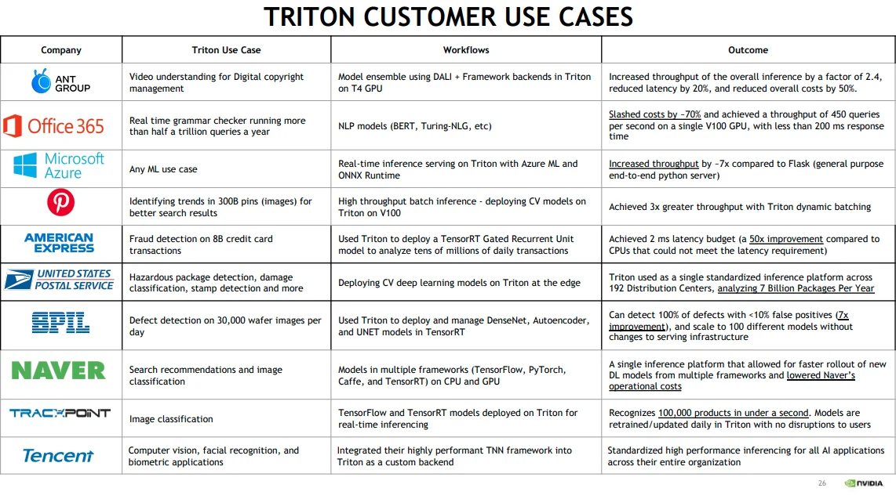
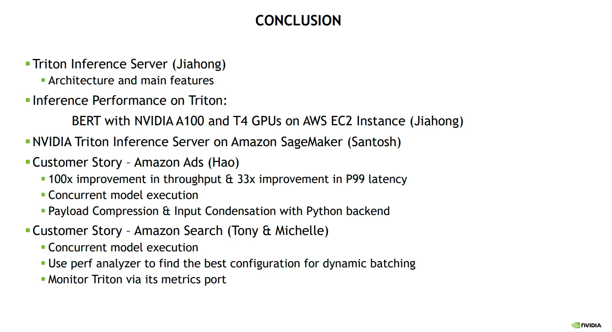

# Python library to optimize Hugging Face transformer for inference: < 0.5 ms latency / 2850 infer/sec

We just launched a new open source Python library to help in **optimizing** Transformer model inference and prepare
**deployment in production**.

It’s a follow up of a proof of concept shared **[on Reddit](https://www.reddit.com/r/MachineLearning/comments/qn8com/p_optimization_of_hugging_face_transformer_models/)**.
Scripts have been converted to a Python library (Apache 2
license) to be used in any NLP project, and documentation has been reworked. We also added **direct** TensorRT support,
which provides another boost in performance compared to the ORT+TRT backend. It will usually provide you with 5X faster
inference compared to vanilla Pytorch, and up to 10X in specific cases. On a RTX 3090, perf_analyzer reports over 2800
inferences per second throughput!

<!-- more -->

Want to try it 👉 [https://github.com/ELS-RD/transformer-deploy](https://github.com/ELS-RD/transformer-deploy)

The README includes some benchmarks on small, base and large transformer architectures to give you an idea of how large
the benefit can be.

To learn more about the whole process you can also check **[this article](https://towardsdatascience.com/hugging-face-transformer-inference-under-1-millisecond-latency-e1be0057a51c?source=friends_link&sk=cd880e05c501c7880f2b9454830b8915)**
showing how this open source library can beat some commercial product from Hugging Face company.

## Why this Python library?

Basically, most tutorials on how to deploy in production a transformer model tell you to take FastAPI and put Pytorch
inside. There are many reasons why it’s a bad idea, first of all, the inference performance is very low.

On the other side of the spectrum, there is Nvidia
demos (**[here](https://github.com/NVIDIA/TensorRT/tree/main/demo/BERT)**
or **[there](https://github.com/NVIDIA/FasterTransformer)**) showing us how to build **manually** a full Transformer
graph (operator by operator) in TensorRT to get best performance from their hardware. It’s out of
reach for many NLP practitioners and it’s time consuming to debug/maintain/adapt to a slightly different architecture (I
tried).
Plus, there is a secret: the very optimized model only works for specific sequence lengths and batch sizes. Truth is
that, so far (and it will improve soon), it’s mainly for MLPerf benchmark (the one used to compare DL hardware),
marketing content, and very specialized engineers.

The usual way to perform model optimization before deployment is to **automatically** convert your existing Pytorch /
Tensorflow model to some kind of graph, apply some optimizations, and deploy the artefact in a production ready
inference server.

For the optimization part, this project leverages both Nvidia TensorRT and Microsoft ONNX Runtime, then you can choose
the best optimized models (benchmark is performed after optimizations). For the inference server, the library will
generate the whole configuration for the Nvidia Triton inference server.

Triton is a mature tool, its API is clear, its documentation covers all typical use cases, etc. Some features may
require some ML deployment knowledge but nothing complex. For TensorRT, it’s another story, the documentation is both
vast and sometimes incomplete, its API evolves rapidly, there are many traps, like in the way you setup model precision
or allocate memory in the GPU RAM. We have not found a single OSS project to take a random Hugging Face model and simply
optimize it with TensorRT. Still, the tool provides the best performance, and we hope this library will help most NLP
practitioners to benefit from it.

As we only target Hugging Face Transformer models, we have made the experience very simple, it only requires a single
command line for the whole process!

If TensorRT and Triton are unknown to you, please find below 2 slides from the recent Nvidia GTC 2021 conference:

From **[slides](https://reg.rainfocus.com/flow/nvidia/nvidiagtc/ap2/page/sessioncatalog/session/1629317744587001TJe7)**

<figure markdown>
  { width="100%", loading=lazy }
</figure>

At the Amazon presentation, we learned that Amazon search and Amazon ads (aka the 💸💰🤑 generators) are also built over
Triton inference servers.

From **[slides](https://reg.rainfocus.com/flow/nvidia/nvidiagtc/ap2/page/sessioncatalog/session/16301005050970010fZk)**

<figure markdown>
  { width="100%", loading=lazy }
</figure>

Still not enough to convince you that you may benefit from them?

Check that article from Microsoft where you will learn that Microsoft Bing is built over Nvidia
TensorRT [https://blogs.bing.com/Engineering-Blog/october-2021/Bing-delivers-more-contextualized-search-using-quantized-transformer-inference-on-NVIDIA-GPUs-in-Azu](https://blogs.bing.com/Engineering-Blog/october-2021/Bing-delivers-more-contextualized-search-using-quantized-transformer-inference-on-NVIDIA-GPUs-in-Azu)

You got it, if ONNX Runtime, TensorRT and Triton are the big guys' tools, they may also help you in your own projects. 
**Let’s democratize them!**
