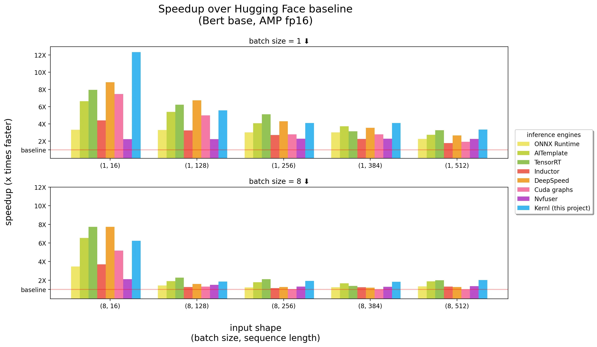

# Up to 12X faster GPU inference on Bert, T5 and other transformers with OpenAI Triton kernels

We are releasing **[Kernl](https://github.com/ELS-RD/kernl/)** under Apache 2 license, a library to make PyTorch models inference significantly faster. 
With 1 line of code we applied the optimizations and made Bert up to 12X faster than Hugging Face baseline. 
T5 is also covered in this first release (> 6X speed up generation and we are still halfway in the optimizations!). 
This has been possible because we wrote custom GPU kernels with the new OpenAI programming language Triton and leveraged TorchDynamo.

- **[Project link](https://github.com/ELS-RD/kernl/)**
- E2E demo notebooks: **[XNLI classification](https://github.com/ELS-RD/kernl/blob/main/tutorial/bert%20e2e.ipynb)**, **[T5 generation](https://github.com/ELS-RD/kernl/blob/main/tutorial/t5%20e2e.ipynb)**

<!-- more -->

<figure markdown>
  { width="100%" }
  <figcaption>Benchmarks ran on a 3090 RTX GPU, 12 cores Intel CPU, more info below</figcaption>
</figure>

On long sequence length inputs, **[Kernl](https://github.com/ELS-RD/kernl/)** is most of the time the fastest inference engine, 
and close to Nvidia TensorRT on shortest ones. 
Keep in mind that Bert is one of the most optimized models out there and most of the tools listed above are very mature.

What is interesting is not that **[Kernl](https://github.com/ELS-RD/kernl/)** is the fastest engine (or not), 
but that the code of the kernels is short and easy to understand and modify. 
We have even added a Triton debugger and a tool (based on Fx) to ease kernel replacement so there is no need to modify PyTorch model source code.

Staying in the comfort of PyTorch / Python maintains dynamic behaviors, debugging and iteration speed. 
Teams designing/training a transformer model (even custom) can take care of the deployment without relying on advanced GPU knowledge 
(eg. CUDA programming, dedicated inference engine API, etc.).

Recently released models relying on slightly modified transformer architectures are rarely accelerated in traditional inference engines, 
we need to wait months to years for someone (usually inference engine maintainers) to write required custom CUDA kernels. 
Because here custom kernels are written in OpenAI Triton language, **anyone without CUDA experience** can easily modify them: 
OpenAI Triton API is simple and close to Numpy one. Kernels source code is significantly shorter than equivalent implementation in CUDA 
(< 200 LoC per kernel). Basic knowledge of how GPU works is enough. 
We are also releasing a few tutorials we initially wrote for onboarding colleagues on the project. 
We hope you will find them useful: [https://github.com/ELS-RD/kernl/tree/main/tutorial](https://github.com/ELS-RD/kernl/tree/main/tutorial). In particular, there is:

- Tiled matmul, the GPU way to perform matmul: [https://github.com/ELS-RD/kernl/blob/main/tutorial/1%20-%20tiled%20matmul.ipynb](https://github.com/ELS-RD/kernl/blob/main/tutorial/1%20-%20tiled%20matmul.ipynb)
- Simple explanation of what Flash attention is and how it works, a fused attention making long sequences much faster: [https://github.com/ELS-RD/kernl/blob/main/tutorial/4%20-%20flash%20attention.ipynb](https://github.com/ELS-RD/kernl/blob/main/tutorial/4%20-%20flash%20attention.ipynb)

And best of the best, because we stay in the PyTorch / Python ecosystem, we plan in our roadmap to also enable **training** with those custom kernels. 
In particular [Flash attention](https://github.com/HazyResearch/flash-attention) kernel should bring a 2-4X speed up and the support of very long sequences on single GPU 
(paper authors went as far as 16K tokens instead of traditional 512 or 2048 limits)! See below for more info.

!!! warning "Benchmarking is a difficult art, we tried to be as fair as possible."

    **Please note that:**

    - Timings are based on wall-clock times and we show speedup over baseline as they are easier to compare between input shapes,
    - When we need to choose between speed and output precision, we always choose precision
    - HF baseline, CUDA graphs, Inductor and [Kernl](https://github.com/ELS-RD/kernl/) are in mixed precision, AITemplate, ONNX Runtime, 
        DeepSpeed and TensorRT have their weights converted to FP16.
    - Accumulation is done in FP32 for AITemplate and [Kernl](https://github.com/ELS-RD/kernl/). TensorRT is likely doing it in FP16.
    - CUDA graphs is enabled for all engines except baseline, Nvfuser and ONNX Runtime which [has a limited support of it](https://github.com/microsoft/onnxruntime/issues/12977#issuecomment-1258406358).
    - For [Kernl](https://github.com/ELS-RD/kernl/) and AITemplate, fast GELU has been manually disabled (TensorRT is likely using Fast GELU).
    - AITemplate measures are to be taken with a grain of salt, it [doesn’t manage attention mask](https://github.com/facebookincubator/AITemplate/issues/46#issuecomment-1279975463) which means 
        1/ batch inference can’t be used in most scenarios (no padding support), 
        2/ it misses few operations on a kernel that can be compute-bounded (depends of sequence length), 
            said otherwise it may make it slower to support attention mask, in particular on long sequences. 
            AITemplate attention mask support will come in a future release.
    - For TensorRT for best perf, we built 3 models, one per batch size. AITemplate will support dynamic shapes in a future release, 
        so we made a model per input shape.
    - Inductor is in prototype stage, performances may be improved when released, 
        none of the disabled by default optimizations worked during our tests.

As you can see, CUDA graphs erase all CPU overhead (Python related for instance), 
sometimes there is no need to rely on C++/Rust to be fast! Fused kernels (in CUDA or Triton) are mostly important for longer input sequence lengths. 
We are aware that there are still some low hanging fruits to improve Kernl performance without sacrificing output precision, 
it’s just the first release. More info about how it works here.

## Lorem ipsum dolor sit amet

Lorem ipsum dolor sit amet, consectetur adipiscing elit. Nulla et euismod
nulla. Curabitur feugiat, tortor non consequat finibus, justo purus auctor
massa, nec semper lorem quam in massa.
