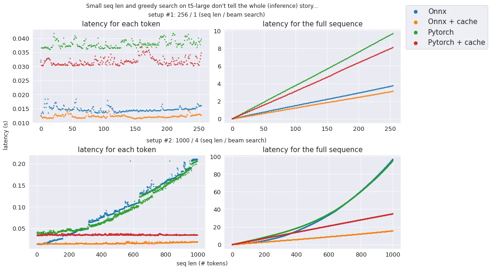
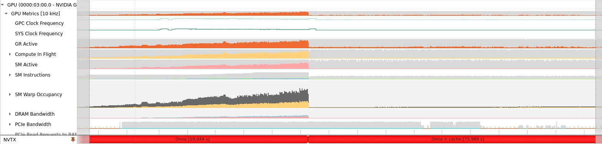

# What we learned by making T5-large 2X faster than Pytorch (and any autoregressive transformer)

We made autoregressive `transformer` based models like `T5-large` **2X faster** than 🤗 Hugging Face Pytorch with **3
simple tricks**:

<!-- more -->

- storing 2 computation graphs in a single `Onnx` file 👯: this let us have both **cache** and **no cache** support
  without having
  any duplicated weights. When cache is used, attention switch from quadratic to linear complexity (less GPU
  computation)
  and `Onnx Runtime` brings us kernel fusion (less memory bound ops);

- **zero copy** 💥 to retrieve output from `Onnx Runtime`: we leverage `Cupy` API to access `Onnx Runtime`
  internal `CUDA` arrays and
  expose them through `Dlpack` to `Pytorch`. It may sound a bit complex, but it let us avoid output tensors copy which
  limit
  our memory footprint and make us much faster (check notebook for other benefits of this approach);

- a generic tool to convert any model (whatever the architecture) to `FP16`: it injects random inputs in the model to
  detect
  nodes that need to be kept in `FP32` because "mixed precision" is more complicated on large generative models (usual
  patterns don't work at large scale).

**notebook
**: [https://github.com/ELS-RD/transformer-deploy/blob/main/demo/generative-model/t5.ipynb](https://github.com/ELS-RD/transformer-deploy/blob/main/demo/generative-model/t5.ipynb) (`Onnx Runtime`
only)

**project**: [https://github.com/ELS-RD/transformer-deploy/](https://github.com/ELS-RD/transformer-deploy/)

> For `TensorRT` we have our own implementation of our approach described above which helps to provide similar latency
> to `Onnx Runtime`. It's in a dedicated `Python` script in the same folder as the notebook. We had to work around a
> documented limitation. Because of that the code is slightly more complex and we wanted to keep this notebook easy to
> read.
>
>  [https://github.com/ELS-RD/transformer-deploy/blob/main/demo/generative-model/t5_tensorrt.py](https://github.com/ELS-RD/transformer-deploy/blob/main/demo/generative-model/t5_tensorrt.py)

<figure markdown>
  { width="100%", loading=lazy }
  <figcaption>Text generation in 2 different setups: no cache == no long seq len</figcaption>
</figure>

## The challenge

We plan to use large autoregressive models like `T5` mainly for few shots learning but they tend to be slow.

We needed something **faster** (including long sequences, large models, etc.), **easy to deploy** (no exotic/custom
framework/hardware/kernel) and **generic** (works on most generative transformer models, NLP related or not, compatible
with
`Onnx Runtime` and `TensorRT` that we are using for other stuff).

In most situations, performing inference with `Onnx Runtime` or `TensorRT` usually brought large improvement over
`Pytorch/Hugging Face` implementation.

In the very specific case of autoregressive languages, things are a bit more complicated. As you know (if not, check the
notebook above for a longer explanation), you can accelerate an autoregressive model by caching Key/Value
representations. By using a cache, for each generated token, you are switching from a quadratic complexity to a linear
one in the self/cross attention modules. Only the first generated token is done without cache.

`Hugging Face` is using this mechanism. When you export your model to `Onnx` using tracing, any control flow instruction
is
lost (including the If instruction to enable or not a cache).

All the T5 inference solutions we found seem to suffer from it (a list of existing solutions and their issues is
provided in the notebook).

## Performance analysis and next steps

With our simple approach, we have made the inference latency mostly linear to the sequence length.Profiling the GPU with
Nvidia Nsight shows that GPU computation capacities are mostly unused. It likely means that we are memory bounded, it
would make sense as for each step, we just perform computations for a single token.

<figure markdown>
  { width="100%", loading=lazy }
  <figcaption>Left side, no cache, GPU is very busy, right side, GPU is waiting memory bound operations (timings are wrong because of the profiler overhead).</figcaption>
</figure>

Going deeper in the analysis, `Onnx Runtime` profiler confirms that we are memory bounded and spend lots of time on
casting to `FP16/FP32`. A strategy to increase performances would be to reduce the number of casting nodes (by a second
pass on the graph to remove unnecessary casting nodes).

<figure markdown>
  { width="100%", loading=lazy }
  <figcaption>Casting nodes should be easy to reduce.</figcaption>
</figure>

Second point, `MatMul` (the only operation where GPU computation capacities are fully used) represent a little part of the
latency because now attention is computed for only one token (excepted the first one). It means that after these
transformations of the computation graph, kernel fusions to reduce the number of memory bounded operations should pay
off in a much bigger way than it did in the past. Hopefully such kernel fusions will land in both `TensorRT` and `Onnx
Runtime` soon.

`Nvidia Triton` server deployment will be released when `Onnx Runtime` 1.12 will be supported (ORT 1.12 should be released
in June, and `Triton`... soon after ?).
